# Universal Parser Platform (UPP) - Master Architecture Document

## World-Class Platform Design for Parser Quality Assurance

**Version:** 1.0.0
**Status:** Architecture Blueprint
**Authors:** Principal Architecture Team
**Last Updated:** January 2025

---

## Executive Vision

> **"Make parser quality measurable, discoverable, and automatic across the entire software ecosystem."**

The Universal Parser Platform will become the **de facto standard** for parser quality assessment, integrating seamlessly with every major package manager and providing value to both developers and non-technical stakeholders.

---

## Table of Contents

1. [Strategic Overview](#1-strategic-overview)
2. [Platform Architecture](#2-platform-architecture)
3. [Package Manager Integration](#3-package-manager-integration)
4. [Automated Scoring System](#4-automated-scoring-system)
5. [User Experience Design](#5-user-experience-design)
6. [Technical Requirements](#6-technical-requirements)
7. [Implementation Roadmap](#7-implementation-roadmap)
8. [Success Metrics](#8-success-metrics)

---

## 1. Strategic Overview

### 1.1 Vision Statement


### 1.2 Problem Statement

```mermaid
graph TB
    subgraph CurrentState["😫 Current State"]
        P1["No standard quality metrics"]
        P2["Manual evaluation required"]
        P3["Fragmented across ecosystems"]
        P4["No visibility for non-tech users"]
        P5["Security risks unknown"]
    end

    subgraph FutureState["😊 Future State with UPP"]
        F1["Universal quality scores"]
        F2["Fully automated testing"]
        F3["Unified across all packages"]
        F4["Dashboard for everyone"]
        F5["Security verified"]
    end

    CurrentState -->|"UPP Platform"| FutureState

    style CurrentState fill:#ffcdd2
    style FutureState fill:#c8e6c9
```



### 1.3 Target Users

| User Type | Needs | UPP Solution |
|-----------|-------|--------------|
| **Developers** | Find best parser quickly | Quality scores + recommendations |
| **Tech Leads** | Ensure team uses quality libs | Policy enforcement + reports |
| **Security Teams** | Identify vulnerabilities | Security scanning + alerts |
| **Product Managers** | Understand dependencies | Non-tech dashboards |
| **Executives** | Risk visibility | Executive reports |
| **Open Source Maintainers** | Improve library quality | Automated feedback |

### 1.4 Key Differentiators

```mermaid
graph LR
    subgraph Differentiators["🌟 What Makes UPP Unique"]
        D1["🎯 Parser-Specific<br/>Deep domain expertise"]
        D2["🔄 Continuous<br/>Real-time monitoring"]
        D3["🌐 Universal<br/>All languages, all packages"]
        D4["🤖 AI-Powered<br/>Edge case generation"]
        D5["👥 Community<br/>Crowdsourced validation"]
    end

    D1 --> VALUE["💎 Unmatched Value"]
    D2 --> VALUE
    D3 --> VALUE
    D4 --> VALUE
    D5 --> VALUE

    style VALUE fill:#ffd700
```



---

## 2. Platform Architecture

### 2.1 High-Level Architecture

```mermaid
graph TB
    subgraph Users["👥 Users"]
        DEV["👨‍💻 Developers"]
        PM["📊 Product Managers"]
        SEC["🔒 Security Teams"]
        EXEC["👔 Executives"]
    end

    subgraph Channels["📱 Access Channels"]
        WEB["🌐 Web Portal"]
        CLI["⌨️ CLI Tool"]
        API["🔌 REST/GraphQL API"]
        IDE["💻 IDE Plugins"]
        PKG["📦 Package Manager Plugins"]
    end

    subgraph Platform["☁️ UPP Cloud Platform"]
        subgraph Gateway["API Gateway"]
            AUTH["🔐 Auth Service"]
            RATE["⚡ Rate Limiter"]
            ROUTE["🔀 Router"]
        end

        subgraph Core["Core Services"]
            SPEC["📋 Spec Service"]
            IMPL["🔧 Implementation Service"]
            SCORE["📊 Scoring Service"]
            SEARCH["🔍 Search Service"]
            NOTIFY["📢 Notification Service"]
        end

        subgraph Engine["Quality Engine"]
            CONFORM["✅ Conformance Tester"]
            BENCH["⚡ Benchmark Runner"]
            SECURITY["🔒 Security Scanner"]
            AI["🤖 AI Test Generator"]
            FUZZ["💥 Fuzzer"]
        end

        subgraph Crawlers["🕷️ Crawlers"]
            NPM["npm Crawler"]
            NUGET["NuGet Crawler"]
            PYPI["PyPI Crawler"]
            MAVEN["Maven Crawler"]
            CARGO["Cargo Crawler"]
            MORE["... 20+ more"]
        end
    end

    subgraph Data["💾 Data Layer"]
        PG[("🐘 PostgreSQL<br/>Primary Data")]
        REDIS[("⚡ Redis<br/>Cache & Queue")]
        ES[("🔍 Elasticsearch<br/>Search Index")]
        S3[("📦 S3<br/>Artifacts")]
        TS[("📈 TimescaleDB<br/>Metrics")]
    end

    Users --> Channels
    Channels --> Gateway
    Gateway --> Core
    Core --> Engine
    Core --> Data
    Crawlers --> Core
    Engine --> Data

    style Platform fill:#e3f2fd
    style Engine fill:#fff9c4
    style Crawlers fill:#c8e6c9
```



### 2.2 Service Architecture Detail

```mermaid
graph TB
    subgraph SpecService["📋 Spec Service"]
        SS1["CRUD Operations"]
        SS2["Version Management"]
        SS3["Validation"]
        SS4["Import/Export"]
    end

    subgraph ImplService["🔧 Implementation Service"]
        IS1["Registration"]
        IS2["Discovery"]
        IS3["Package Linking"]
        IS4["Status Tracking"]
    end

    subgraph ScoreService["📊 Scoring Service"]
        SC1["Score Calculation"]
        SC2["Ranking Engine"]
        SC3["Trend Analysis"]
        SC4["Comparison"]
    end

    subgraph QualityEngine["⚙️ Quality Engine"]
        QE1["Test Orchestrator"]
        QE2["Result Aggregator"]
        QE3["Report Generator"]
    end

    SpecService --> QualityEngine
    ImplService --> QualityEngine
    QualityEngine --> ScoreService

    style SpecService fill:#e3f2fd
    style ImplService fill:#c8e6c9
    style ScoreService fill:#fff9c4
    style QualityEngine fill:#fce4ec
```



### 2.3 Data Model Overview


### 2.4 Microservices Communication


---

## 3. Package Manager Integration

### 3.1 Integration Strategy


### 3.2 Supported Package Managers

| Registry | Language(s) | Priority | Estimated Packages | Parser Libraries |
|----------|-------------|----------|-------------------|------------------|
| **npm** | JavaScript, TypeScript | P0 | 2M+ | ~500 |
| **NuGet** | C#, F#, VB.NET | P0 | 350K+ | ~200 |
| **PyPI** | Python | P0 | 450K+ | ~300 |
| **Maven Central** | Java, Kotlin, Scala | P0 | 500K+ | ~400 |
| **crates.io** | Rust | P1 | 120K+ | ~150 |
| **RubyGems** | Ruby | P1 | 175K+ | ~100 |
| **Go Modules** | Go | P1 | 1M+ | ~200 |
| **Packagist** | PHP | P1 | 350K+ | ~150 |
| **Hex** | Elixir, Erlang | P2 | 15K+ | ~50 |
| **Hackage** | Haskell | P2 | 17K+ | ~100 |
| **CPAN** | Perl | P2 | 40K+ | ~80 |
| **CocoaPods** | Swift, Obj-C | P2 | 90K+ | ~60 |
| **Pub** | Dart, Flutter | P2 | 40K+ | ~40 |
| **Conda** | Python, R | P2 | 20K+ | ~100 |
| **vcpkg** | C, C++ | P2 | 2K+ | ~50 |
| **Conan** | C, C++ | P2 | 1.5K+ | ~40 |

### 3.3 Crawler Architecture


### 3.4 Parser Detection Algorithm


### 3.5 Package Integration Data Model

```yaml
# Package Integration Record
package_integration:
  id: "uuid"
  registry: "npm"
  package_name: "fast-json-parser"
  package_version: "3.2.1"

  detection:
    method: "keyword+manifest"
    confidence: 0.92
    detected_at: "2025-01-15T10:30:00Z"

  categorization:
    parser_type: "json"
    category: "data-interchange"
    subcategory: "text"

  spec_matching:
    matched_spec_id: "urn:ups:parser:ietf:json:rfc8259"
    match_confidence: 0.95
    match_method: "semantic"

  quality_status:
    last_tested: "2025-01-15T12:00:00Z"
    score: 87.5
    rank: 3
    trend: "stable"

  metadata:
    downloads_weekly: 1500000
    github_stars: 12500
    last_publish: "2024-12-01"
    maintainers: ["author@example.com"]
```

### 3.6 Registry Integration APIs


---

## 4. Automated Scoring System

### 4.1 Scoring Architecture

```mermaid
graph TB
    subgraph Input["📥 Input"]
        IMPL["Implementation"]
        SPEC["UPS Spec"]
        PKG["Package Metadata"]
    end

    subgraph Engine["⚙️ Quality Engine"]
        subgraph Testers["Test Components"]
            CONFORM["✅ Conformance<br/>Tester"]
            PERF["⚡ Performance<br/>Tester"]
            SEC["🔒 Security<br/>Tester"]
            MAINT["📚 Maintainability<br/>Analyzer"]
            COMM["👥 Community<br/>Analyzer"]
        end

        subgraph Aggregator["Score Aggregator"]
            NORM["Normalizer"]
            WEIGHT["Weight Applier"]
            PENALTY["Penalty Calculator"]
            FINAL["Final Score"]
        end
    end

    subgraph Output["📤 Output"]
        SCORE["Quality Score"]
        RANK["Ranking"]
        REPORT["Detailed Report"]
        BADGE["Quality Badge"]
    end

    Input --> Testers
    Testers --> Aggregator
    Aggregator --> Output

    style Engine fill:#fff9c4
```



### 4.2 Scoring Dimensions Detail


#### 4.2.1 Conformance Score (30%)

```yaml
conformance_scoring:
  weight: 0.30

  components:
    test_pass_rate:
      weight: 0.50
      calculation: "passed_tests / total_tests"

    property_test_success:
      weight: 0.20
      calculation: "successful_properties / total_properties"

    edge_case_coverage:
      weight: 0.15
      calculation: "edge_cases_passed / edge_cases_total"

    fuzz_survival_rate:
      weight: 0.15
      calculation: "1 - (crashes / fuzz_iterations)"

  penalties:
    - condition: "any_critical_test_failed"
      penalty: 0.50
    - condition: "conformance < 95%"
      penalty: 0.10

  levels:
    level_0: { min_score: 0.80, requirements: ["basic_tests"] }
    level_1: { min_score: 0.90, requirements: ["basic_tests", "edge_cases"] }
    level_2: { min_score: 0.95, requirements: ["all_tests", "property_tests"] }
    level_3: { min_score: 0.99, requirements: ["all_tests", "fuzzing"] }
```

#### 4.2.2 Performance Score (25%)

```yaml
performance_scoring:
  weight: 0.25

  components:
    throughput:
      weight: 0.40
      metrics:
        - name: "mb_per_second"
          benchmarks: ["small_file", "medium_file", "large_file"]
      calculation: "percentile_rank(throughput, all_implementations)"

    latency:
      weight: 0.30
      metrics:
        - name: "p50_microseconds"
        - name: "p99_microseconds"
        - name: "p999_microseconds"
      calculation: "weighted_percentile_rank"

    memory_efficiency:
      weight: 0.20
      metrics:
        - name: "peak_memory_mb"
        - name: "memory_per_mb_input"
      calculation: "inverse_percentile_rank"

    startup_time:
      weight: 0.10
      metrics:
        - name: "cold_start_ms"
        - name: "warm_start_ms"
      calculation: "inverse_percentile_rank"

  normalization:
    method: "percentile_within_language"
    baseline: "median_implementation"
```

#### 4.2.3 Security Score (25%)

```yaml
security_scoring:
  weight: 0.25

  components:
    vulnerability_scan:
      weight: 0.40
      tools: ["semgrep", "codeql", "snyk"]
      scoring:
        critical: -50
        high: -20
        medium: -5
        low: -1

    fuzz_testing:
      weight: 0.30
      metrics:
        - name: "crash_rate"
          target: 0
        - name: "hang_rate"
          target: 0
        - name: "memory_issues"
          target: 0

    protection_coverage:
      weight: 0.20
      required_protections:
        - "stack_overflow_protection"
        - "input_size_limits"
        - "recursion_depth_limits"
        - "timeout_handling"

    dependency_security:
      weight: 0.10
      checks:
        - "no_vulnerable_dependencies"
        - "dependencies_up_to_date"

  penalties:
    - condition: "critical_vulnerability"
      penalty: 1.00  # Immediate disqualification
    - condition: "high_vulnerability"
      penalty: 0.50
```

#### 4.2.4 Maintainability Score (10%)

```yaml
maintainability_scoring:
  weight: 0.10

  components:
    documentation:
      weight: 0.30
      checks:
        - "readme_exists"
        - "api_documented"
        - "examples_provided"
        - "changelog_maintained"

    code_quality:
      weight: 0.30
      metrics:
        - "test_coverage_percent"
        - "cyclomatic_complexity"
        - "code_duplication"

    activity:
      weight: 0.25
      metrics:
        - "days_since_last_commit"
        - "open_issues_ratio"
        - "pr_response_time"

    compatibility:
      weight: 0.15
      checks:
        - "semantic_versioning"
        - "breaking_change_policy"
        - "deprecation_warnings"
```

#### 4.2.5 Community Score (10%)

```yaml
community_scoring:
  weight: 0.10

  components:
    popularity:
      weight: 0.40
      metrics:
        - "weekly_downloads"
        - "github_stars"
        - "dependent_packages"

    user_satisfaction:
      weight: 0.35
      metrics:
        - "ups_upvotes"
        - "ups_downvotes"
        - "github_issues_sentiment"

    ecosystem_trust:
      weight: 0.25
      factors:
        - "maintainer_reputation"
        - "organization_verified"
        - "security_audit_passed"
```

### 4.3 Score Calculation Pipeline

```mermaid
flowchart TB
    subgraph Collection["1️⃣ Data Collection"]
        C1["Run conformance tests"]
        C2["Run benchmarks"]
        C3["Run security scans"]
        C4["Fetch package metadata"]
        C5["Analyze code quality"]
    end

    subgraph Normalization["2️⃣ Normalization"]
        N1["Normalize to 0-100 scale"]
        N2["Apply language-specific baselines"]
        N3["Calculate percentile ranks"]
    end

    subgraph Weighting["3️⃣ Weight Application"]
        W1["Apply dimension weights"]
        W2["Apply component weights"]
        W3["Calculate weighted sum"]
    end

    subgraph Penalties["4️⃣ Penalty Processing"]
        P1["Check critical failures"]
        P2["Apply penalty multipliers"]
        P3["Floor at 0"]
    end

    subgraph Output["5️⃣ Final Score"]
        O1["Composite score"]
        O2["Dimension breakdown"]
        O3["Ranking update"]
        O4["Badge assignment"]
    end

    Collection --> Normalization --> Weighting --> Penalties --> Output
```



### 4.4 Benchmark Execution Environment

```mermaid
graph TB
    subgraph Infrastructure["🏗️ Benchmark Infrastructure"]
        subgraph Scheduler["Job Scheduler"]
            QUEUE["Job Queue"]
            PRIORITY["Priority Manager"]
        end

        subgraph Workers["Isolated Workers"]
            W1["Worker 1<br/>x86_64, 8 cores"]
            W2["Worker 2<br/>ARM64, 8 cores"]
            W3["Worker 3<br/>x86_64, 8 cores"]
        end

        subgraph Containers["Execution Containers"]
            C1["Docker Container<br/>Memory limited<br/>CPU pinned<br/>Network isolated"]
        end

        subgraph Monitoring["Monitoring"]
            METRICS["Metrics Collector"]
            TRACE["Trace Aggregator"]
        end
    end

    QUEUE --> Workers
    Workers --> Containers
    Containers --> Monitoring

    style Infrastructure fill:#e3f2fd
```



### 4.5 AI-Powered Test Generation


---

## 5. User Experience Design

### 5.1 User Journey Maps

#### Developer Journey


#### Non-Technical User Journey


### 5.2 Interface Designs

#### 5.2.1 Developer CLI Experience

```bash
# Search for parsers
$ upp search json --language typescript
╔════════════════════════════════════════════════════════════════╗
║  UPP Parser Search: json (TypeScript)                          ║
╠════════════════════════════════════════════════════════════════╣
║  Rank  Package              Score  Conformance  Performance    ║
╠════════════════════════════════════════════════════════════════╣
║  🥇 1   fast-json-parser     94.5   100%         ████████░░    ║
║  🥈 2   json-typescript      91.2   100%         ███████░░░    ║
║  🥉 3   ts-json-validator    87.8    98%         ██████░░░░    ║
║     4   simple-json-ts       82.1    95%         █████░░░░░    ║
║     5   json-lite            78.5    92%         ████░░░░░░    ║
╚════════════════════════════════════════════════════════════════╝

$ upp info fast-json-parser
╔════════════════════════════════════════════════════════════════╗
║  fast-json-parser v3.2.1                                       ║
║  ⭐ Score: 94.5/100  |  🏆 Rank: #1 of 47 TypeScript parsers   ║
╠════════════════════════════════════════════════════════════════╣
║  Quality Breakdown:                                            ║
║  ├── ✅ Conformance:    100% (30.0 pts) ████████████████████   ║
║  ├── ⚡ Performance:     92% (23.0 pts) ██████████████████░░   ║
║  ├── 🔒 Security:        95% (23.8 pts) ███████████████████░   ║
║  ├── 📚 Maintainability: 85% ( 8.5 pts) █████████████████░░░   ║
║  └── 👥 Community:       92% ( 9.2 pts) ██████████████████░░   ║
╠════════════════════════════════════════════════════════════════╣
║  📦 npm: npm install fast-json-parser                          ║
║  📋 Spec: JSON Parser (RFC 8259)                               ║
║  🔗 https://upp.dev/packages/npm/fast-json-parser              ║
╚════════════════════════════════════════════════════════════════╝

$ upp verify package.json
╔════════════════════════════════════════════════════════════════╗
║  Dependency Verification Results                               ║
╠════════════════════════════════════════════════════════════════╣
║  Parser Dependencies Found: 3                                  ║
║                                                                 ║
║  ✅ fast-json-parser    3.2.1   Score: 94.5   Approved        ║
║  ⚠️  xml-reader         2.1.0   Score: 72.3   Review Required ║
║  ❌ old-csv-parser      1.0.0   Score: 45.2   Policy Violation ║
╠════════════════════════════════════════════════════════════════╣
║  Policy: min_score=70, require_security=true                   ║
║  Result: 1 violation found                                     ║
╚════════════════════════════════════════════════════════════════╝
```

#### 5.2.2 Web Dashboard - Developer View

```
┌─────────────────────────────────────────────────────────────────────────────┐
│  🏠 UPP Dashboard                          🔍 Search...        👤 Profile  │
├─────────────────────────────────────────────────────────────────────────────┤
│                                                                             │
│  ┌─────────────────────────────────────────────────────────────────────┐   │
│  │  📊 Parser Quality Leaderboard                    [Filter ▼] [⚙️]   │   │
│  ├─────────────────────────────────────────────────────────────────────┤   │
│  │                                                                     │   │
│  │  Category: JSON Parsers    Language: All    Sort: Quality Score ▼  │   │
│  │                                                                     │   │
│  │  ┌─────┬────────────────────┬───────┬──────────────────────────┐   │   │
│  │  │Rank │ Package            │ Score │ Trend      │ Language    │   │   │
│  │  ├─────┼────────────────────┼───────┼────────────┼─────────────┤   │   │
│  │  │ 🥇  │ simdjson           │ 98.2  │ ━━━━━━━▲   │ C++         │   │   │
│  │  │ 🥈  │ System.Text.Json   │ 96.5  │ ━━━━━━━━   │ C#          │   │   │
│  │  │ 🥉  │ serde_json         │ 95.8  │ ━━━━━━━━   │ Rust        │   │   │
│  │  │  4  │ orjson             │ 94.2  │ ━━━━━━▲    │ Python      │   │   │
│  │  │  5  │ fast-json-parser   │ 93.5  │ ━━━━━━━━   │ TypeScript  │   │   │
│  │  │  6  │ Jackson            │ 92.1  │ ━━━━━▼     │ Java        │   │   │
│  │  │  7  │ encoding/json      │ 91.8  │ ━━━━━━━━   │ Go          │   │   │
│  │  └─────┴────────────────────┴───────┴────────────┴─────────────┘   │   │
│  │                                                                     │   │
│  │  [Load More...]                                                     │   │
│  └─────────────────────────────────────────────────────────────────────┘   │
│                                                                             │
│  ┌──────────────────────────┐  ┌──────────────────────────────────────┐   │
│  │  🏆 Recent Challenges     │  │  📈 Trending Parsers                 │   │
│  ├──────────────────────────┤  ├──────────────────────────────────────┤   │
│  │  simdjson vs RapidJSON   │  │  1. 🔥 ultra-fast-xml (+15 ranks)    │   │
│  │  Result: simdjson wins   │  │  2. 🔥 new-yaml-parser (+8 ranks)    │   │
│  │  ──────────────────────  │  │  3. ⬆️ proto-decoder (+3 ranks)      │   │
│  │  orjson vs ujson         │  │  4. ⬆️ csv-turbo (+2 ranks)          │   │
│  │  Status: Voting Open     │  │  5. ⬇️ legacy-json (-5 ranks)        │   │
│  └──────────────────────────┘  └──────────────────────────────────────┘   │
│                                                                             │
└─────────────────────────────────────────────────────────────────────────────┘
```

#### 5.2.3 Web Dashboard - Executive View

```
┌─────────────────────────────────────────────────────────────────────────────┐
│  🏠 UPP Executive Dashboard                               👤 John Smith    │
│  Organization: Acme Corp                                                    │
├─────────────────────────────────────────────────────────────────────────────┤
│                                                                             │
│  ┌───────────────────┐ ┌───────────────────┐ ┌───────────────────┐         │
│  │  📦 Parser Deps   │ │  ⚠️ Risk Level    │ │  ✅ Compliance    │         │
│  │       47          │ │      LOW          │ │      94%          │         │
│  │  ▲ +3 this month  │ │  ▼ improved       │ │  ▲ +2% this week  │         │
│  └───────────────────┘ └───────────────────┘ └───────────────────┘         │
│                                                                             │
│  ┌─────────────────────────────────────────────────────────────────────┐   │
│  │  📊 Parser Quality Distribution                                     │   │
│  ├─────────────────────────────────────────────────────────────────────┤   │
│  │                                                                     │   │
│  │  Excellent (90+)  ████████████████████░░░░░░░░░░  38 packages      │   │
│  │  Good (70-89)     ████████░░░░░░░░░░░░░░░░░░░░░░   7 packages      │   │
│  │  Fair (50-69)     ██░░░░░░░░░░░░░░░░░░░░░░░░░░░░   2 packages      │   │
│  │  Poor (<50)       ░░░░░░░░░░░░░░░░░░░░░░░░░░░░░░   0 packages      │   │
│  │                                                                     │   │
│  └─────────────────────────────────────────────────────────────────────┘   │
│                                                                             │
│  ┌─────────────────────────────────────────────────────────────────────┐   │
│  │  ⚠️ Action Required                                                 │   │
│  ├─────────────────────────────────────────────────────────────────────┤   │
│  │                                                                     │   │
│  │  🔴 HIGH: xml-legacy-parser has critical vulnerability (CVE-2025)  │   │
│  │     Used in: 3 projects | Recommendation: Upgrade to v2.1+         │   │
│  │     [View Details] [Create Ticket] [Dismiss]                       │   │
│  │                                                                     │   │
│  │  🟡 MEDIUM: csv-reader score dropped from 85 to 72                 │   │
│  │     Reason: Failing new conformance tests | [Review]               │   │
│  │                                                                     │   │
│  └─────────────────────────────────────────────────────────────────────┘   │
│                                                                             │
│  [📄 Generate Report]  [📧 Share with Team]  [📅 Schedule Review]          │
│                                                                             │
└─────────────────────────────────────────────────────────────────────────────┘
```

### 5.3 Non-Technical User Features


### 5.4 IDE Integration

```mermaid
graph LR
    subgraph IDEPlugins["💻 IDE Plugins"]
        VS["VS Code"]
        JB["JetBrains"]
        VIS["Visual Studio"]
    end

    subgraph Features["Features"]
        INLINE["Inline quality badges"]
        HOVER["Hover for details"]
        QUICK["Quick actions"]
        SUGGEST["Better alternatives"]
    end

    subgraph Example["Example: package.json"]
        CODE["dependencies:<br/>  'json-parser': '^2.0'  ⚠️ 72<br/>  'xml-reader': '^1.5'   ✅ 94"]
    end

    IDEPlugins --> Features --> Example
```



---

## 6. Technical Requirements

### 6.1 Functional Requirements

#### FR1: Specification Management

| ID | Requirement | Priority | Notes |
|----|-------------|----------|-------|
| FR1.1 | Create/Read/Update/Delete parser specifications | P0 | YAML/JSON format |
| FR1.2 | Version specifications with semantic versioning | P0 | Support major/minor/patch |
| FR1.3 | Import specifications from external sources | P1 | ANTLR, Kaitai, etc. |
| FR1.4 | Export specifications to various formats | P1 | JSON, YAML, PDF |
| FR1.5 | Validate specifications against JSON Schema | P0 | Real-time validation |

#### FR2: Implementation Management

| ID | Requirement | Priority | Notes |
|----|-------------|----------|-------|
| FR2.1 | Register implementations linking to packages | P0 | npm, NuGet, PyPI, etc. |
| FR2.2 | Auto-discover parsers from package registries | P0 | Crawler-based |
| FR2.3 | Track implementation versions | P0 | Map to package versions |
| FR2.4 | Link implementations to specifications | P0 | Manual + automatic |
| FR2.5 | Support multiple implementations per spec/language | P0 | Ranking required |

#### FR3: Quality Scoring

| ID | Requirement | Priority | Notes |
|----|-------------|----------|-------|
| FR3.1 | Run conformance tests automatically | P0 | From spec test vectors |
| FR3.2 | Execute performance benchmarks | P0 | Isolated environment |
| FR3.3 | Perform security scans | P0 | Multiple tools |
| FR3.4 | Calculate composite quality scores | P0 | Weighted algorithm |
| FR3.5 | Generate rankings per language/category | P0 | Real-time updates |
| FR3.6 | Track score history and trends | P1 | Time series data |

#### FR4: Package Manager Integration

| ID | Requirement | Priority | Notes |
|----|-------------|----------|-------|
| FR4.1 | Crawl npm registry for parser packages | P0 | 6-hour intervals |
| FR4.2 | Crawl NuGet registry for parser packages | P0 | 6-hour intervals |
| FR4.3 | Crawl PyPI registry for parser packages | P0 | 6-hour intervals |
| FR4.4 | Crawl Maven Central for parser packages | P1 | 12-hour intervals |
| FR4.5 | Support webhook notifications from registries | P1 | Real-time updates |

#### FR5: User Interface

| ID | Requirement | Priority | Notes |
|----|-------------|----------|-------|
| FR5.1 | Provide web dashboard for all users | P0 | Responsive design |
| FR5.2 | Provide CLI tool for developers | P0 | Cross-platform |
| FR5.3 | Provide REST API for integrations | P0 | OpenAPI documented |
| FR5.4 | Provide GraphQL API for flexible queries | P1 | Optional |
| FR5.5 | Support IDE plugins (VS Code, JetBrains) | P1 | Marketplace publish |

### 6.2 Non-Functional Requirements

#### NFR1: Performance

| ID | Requirement | Target | Notes |
|----|-------------|--------|-------|
| NFR1.1 | API response time (p95) | < 200ms | For queries |
| NFR1.2 | Search response time (p95) | < 500ms | Full-text search |
| NFR1.3 | Dashboard load time | < 2s | Initial render |
| NFR1.4 | Score calculation throughput | 1000/hour | Per language |
| NFR1.5 | Crawler throughput | 10,000 packages/hour | All registries |

#### NFR2: Scalability

| ID | Requirement | Target | Notes |
|----|-------------|--------|-------|
| NFR2.1 | Support concurrent users | 100,000 | Monthly active |
| NFR2.2 | Support registered packages | 10,000,000 | All registries |
| NFR2.3 | Support scored implementations | 100,000 | Actively scored |
| NFR2.4 | Support specifications | 10,000 | Community + official |
| NFR2.5 | Horizontal scaling | Auto-scale | Kubernetes-based |

#### NFR3: Reliability

| ID | Requirement | Target | Notes |
|----|-------------|--------|-------|
| NFR3.1 | System availability | 99.9% | Monthly SLA |
| NFR3.2 | Data durability | 99.999999% | 8 nines |
| NFR3.3 | Disaster recovery RTO | < 4 hours | Full recovery |
| NFR3.4 | Disaster recovery RPO | < 1 hour | Data loss limit |
| NFR3.5 | Zero data loss for scores | 100% | Critical data |

#### NFR4: Security

| ID | Requirement | Target | Notes |
|----|-------------|--------|-------|
| NFR4.1 | Authentication | OAuth 2.0 + OIDC | GitHub, Google, etc. |
| NFR4.2 | Authorization | RBAC + ABAC | Fine-grained |
| NFR4.3 | Data encryption at rest | AES-256 | All sensitive data |
| NFR4.4 | Data encryption in transit | TLS 1.3 | All connections |
| NFR4.5 | Audit logging | Complete | All actions logged |
| NFR4.6 | Sandbox execution | Full isolation | Container-based |

### 6.3 Technology Stack

```mermaid
graph TB
    subgraph Frontend["🎨 Frontend"]
        NEXT["Next.js 14"]
        REACT["React 18"]
        TS_FE["TypeScript"]
        TAILWIND["Tailwind CSS"]
        CHARTS["Recharts"]
    end

    subgraph Backend["⚙️ Backend"]
        DOTNET[".NET 8"]
        CSHARP["C#"]
        EF["Entity Framework Core"]
        MEDIATR["MediatR (CQRS)"]
        GRPC["gRPC"]
    end

    subgraph Data["💾 Data"]
        POSTGRES["PostgreSQL 16"]
        REDIS["Redis 7"]
        ELASTIC["Elasticsearch 8"]
        TIMESCALE["TimescaleDB"]
        S3["S3/MinIO"]
    end

    subgraph Infrastructure["🏗️ Infrastructure"]
        K8S["Kubernetes"]
        DOCKER["Docker"]
        ISTIO["Istio Service Mesh"]
        VAULT["HashiCorp Vault"]
        PROMETHEUS["Prometheus"]
        GRAFANA["Grafana"]
    end

    subgraph AI["🤖 AI/ML"]
        CLAUDE["Claude API"]
        OPENAI["OpenAI API"]
        HUGGING["HuggingFace"]
    end

    subgraph Quality["🔬 Quality Tools"]
        SEMGREP["Semgrep"]
        CODEQL["CodeQL"]
        FUZZER["AFL/LibFuzzer"]
        BENCHMARK["BenchmarkDotNet"]
    end

    Frontend --> Backend
    Backend --> Data
    Backend --> AI
    Backend --> Quality
    Infrastructure --> Backend

    style Frontend fill:#e3f2fd
    style Backend fill:#c8e6c9
    style Data fill:#fff9c4
    style Infrastructure fill:#fce4ec
    style AI fill:#e1bee7
    style Quality fill:#b3e5fc
```

---

## 7. Implementation Roadmap

### 7.1 Phase Overview

```mermaid
gantt
    title UPP Implementation Roadmap
    dateFormat YYYY-MM

    section Phase 1: Foundation
    Core Infrastructure        :done, p1a, 2025-01, 2025-02
    Spec Management           :done, p1b, 2025-01, 2025-02
    Basic API                 :active, p1c, 2025-02, 2025-03
    Basic Web UI              :p1d, 2025-03, 2025-04

    section Phase 2: Quality Engine
    Conformance Testing       :p2a, 2025-04, 2025-05
    Performance Benchmarking  :p2b, 2025-05, 2025-06
    Security Scanning         :p2c, 2025-06, 2025-07
    Score Calculation         :p2d, 2025-07, 2025-08

    section Phase 3: Integration
    npm Crawler               :p3a, 2025-07, 2025-08
    NuGet Crawler             :p3b, 2025-08, 2025-09
    PyPI Crawler              :p3c, 2025-09, 2025-10
    CLI Tool                  :p3d, 2025-08, 2025-10

    section Phase 4: AI & Scale
    AI Test Generation        :p4a, 2025-10, 2025-12
    Additional Registries     :p4b, 2025-10, 2026-01
    IDE Plugins               :p4c, 2025-11, 2026-01
    Enterprise Features       :p4d, 2025-12, 2026-02

    section Phase 5: Ecosystem
    Challenge Arena           :p5a, 2026-01, 2026-03
    Certification Program     :p5b, 2026-02, 2026-04
    Standards Adoption        :p5c, 2026-03, 2026-06
```

### 7.2 Phase 1: Foundation (Months 1-4)

#### Objectives
- Establish core infrastructure
- Implement specification management
- Build basic API and web interface

#### Deliverables

| Deliverable | Description | Timeline |
|-------------|-------------|----------|
| Infrastructure | Kubernetes cluster, databases, monitoring | Month 1 |
| Spec Service | CRUD for UPS specifications | Month 1-2 |
| API Gateway | Authentication, rate limiting, routing | Month 2 |
| REST API v1 | Core endpoints for specs and implementations | Month 2-3 |
| Web Dashboard v1 | Basic spec browser and viewer | Month 3-4 |
| Documentation | API docs, user guides | Month 4 |

#### Architecture for Phase 1

```mermaid
graph TB
    subgraph Phase1["Phase 1 Architecture"]
        WEB["Web UI (Next.js)"]
        API["API (.NET 8)"]
        DB[("PostgreSQL")]
        CACHE[("Redis")]

        WEB --> API
        API --> DB
        API --> CACHE
    end
```

### 7.3 Phase 2: Quality Engine (Months 4-8)

#### Objectives
- Build conformance testing framework
- Implement benchmark infrastructure
- Develop security scanning pipeline
- Create scoring algorithm

#### Deliverables

| Deliverable | Description | Timeline |
|-------------|-------------|----------|
| Test Runner | Execute conformance tests in containers | Month 4-5 |
| Benchmark Engine | Isolated performance measurement | Month 5-6 |
| Security Scanner | Vulnerability detection pipeline | Month 6-7 |
| Score Calculator | Weighted scoring algorithm | Month 7-8 |
| Leaderboard | Rankings by spec/language | Month 8 |

#### Quality Engine Architecture

```mermaid
graph TB
    subgraph QualityPhase["Phase 2: Quality Engine"]
        ORCH["Orchestrator"]

        subgraph Workers["Test Workers"]
            TW1["Conformance Worker"]
            TW2["Benchmark Worker"]
            TW3["Security Worker"]
        end

        subgraph Storage["Results Storage"]
            TS[("TimescaleDB")]
            S3["Artifact Storage"]
        end

        QUEUE["Job Queue (Redis)"]

        ORCH --> QUEUE
        QUEUE --> Workers
        Workers --> Storage
    end
```

### 7.4 Phase 3: Package Integration (Months 7-10)

#### Objectives
- Build package registry crawlers
- Implement parser detection
- Create CLI tool
- Enable automatic scoring

#### Deliverables

| Deliverable | Description | Timeline |
|-------------|-------------|----------|
| npm Crawler | Discover and analyze npm packages | Month 7-8 |
| NuGet Crawler | Discover and analyze NuGet packages | Month 8-9 |
| PyPI Crawler | Discover and analyze PyPI packages | Month 9-10 |
| Parser Detector | ML-based parser identification | Month 8-9 |
| CLI Tool | Developer command-line interface | Month 8-10 |
| Package Linker | Auto-link packages to specs | Month 9-10 |

#### Crawler Architecture

```mermaid
graph TB
    subgraph CrawlerPhase["Phase 3: Crawlers"]
        SCHED["Scheduler"]

        subgraph Crawlers["Registry Crawlers"]
            NPM["npm"]
            NUGET["NuGet"]
            PYPI["PyPI"]
        end

        DETECT["Parser Detector"]
        LINK["Spec Linker"]
        QUEUE["Score Queue"]

        SCHED --> Crawlers
        Crawlers --> DETECT
        DETECT --> LINK
        LINK --> QUEUE
    end
```

### 7.5 Phase 4: AI & Scale (Months 10-14)

#### Objectives
- Implement AI-powered test generation
- Scale to additional registries
- Build IDE plugins
- Add enterprise features

#### Deliverables

| Deliverable | Description | Timeline |
|-------------|-------------|----------|
| AI Test Generator | Claude-powered edge case generation | Month 10-12 |
| Maven Crawler | Java/Kotlin package discovery | Month 10-11 |
| Cargo Crawler | Rust package discovery | Month 11-12 |
| Go Modules Crawler | Go package discovery | Month 12-13 |
| VS Code Extension | IDE integration | Month 11-13 |
| JetBrains Plugin | IDE integration | Month 12-14 |
| Organization Features | Teams, policies, reports | Month 13-14 |

### 7.6 Phase 5: Ecosystem (Months 14-18)

#### Objectives
- Launch challenge arena
- Establish certification program
- Drive standards adoption
- Build community

#### Deliverables

| Deliverable | Description | Timeline |
|-------------|-------------|----------|
| Challenge Arena | Implementation competition system | Month 14-16 |
| Voting System | Community voting on challenges | Month 15-16 |
| Certification | Quality certification program | Month 15-17 |
| Badges | Embeddable quality badges | Month 16 |
| Standards Liaison | IETF/W3C engagement | Month 16-18 |
| Community Portal | Forums, contributions | Month 17-18 |

### 7.7 Team Structure

```mermaid
graph TB
    subgraph TeamStructure["👥 Team Structure"]
        subgraph Leadership["Leadership"]
            CTO["CTO/Architect"]
            PM["Product Manager"]
        end

        subgraph Platform["Platform Team"]
            BE1["Backend Lead"]
            BE2["Backend Engineer x2"]
            FE1["Frontend Lead"]
            FE2["Frontend Engineer x2"]
        end

        subgraph Quality["Quality Engine Team"]
            QE1["Quality Lead"]
            QE2["Test Engineer x2"]
            SEC["Security Engineer"]
        end

        subgraph Integration["Integration Team"]
            INT1["Integration Lead"]
            INT2["Integration Engineer x2"]
            ML["ML Engineer"]
        end

        subgraph DevOps["DevOps Team"]
            DO1["DevOps Lead"]
            DO2["SRE x2"]
        end
    end

    Leadership --> Platform
    Leadership --> Quality
    Leadership --> Integration
    Leadership --> DevOps
```

### 7.8 Budget Estimate

| Category | Phase 1-2 | Phase 3-4 | Phase 5 | Total |
|----------|-----------|-----------|---------|-------|
| Personnel (15 FTE) | $600K | $800K | $500K | $1.9M |
| Infrastructure | $50K | $100K | $150K | $300K |
| AI/ML APIs | $20K | $50K | $50K | $120K |
| Tools/Licenses | $30K | $40K | $30K | $100K |
| **Total** | **$700K** | **$990K** | **$730K** | **$2.42M** |

---

## 8. Success Metrics

### 8.1 Key Performance Indicators

```mermaid
graph TB
    subgraph KPIs["📊 Key Performance Indicators"]
        subgraph Adoption["📈 Adoption Metrics"]
            A1["Registered Users"]
            A2["API Calls/Month"]
            A3["CLI Downloads"]
            A4["IDE Plugin Installs"]
        end

        subgraph Coverage["🌐 Coverage Metrics"]
            C1["Packages Scored"]
            C2["Registries Integrated"]
            C3["Languages Supported"]
            C4["Specs Published"]
        end

        subgraph Quality["✅ Quality Metrics"]
            Q1["Score Accuracy"]
            Q2["False Positive Rate"]
            Q3["Test Coverage"]
            Q4["Uptime SLA"]
        end

        subgraph Business["💰 Business Metrics"]
            B1["Enterprise Customers"]
            B2["Revenue (if applicable)"]
            B3["NPS Score"]
            B4["Community Contributions"]
        end
    end
```

### 8.2 Success Targets

| Metric | Year 1 | Year 2 | Year 3 |
|--------|--------|--------|--------|
| **Registered Users** | 10,000 | 50,000 | 200,000 |
| **Monthly API Calls** | 1M | 10M | 100M |
| **Packages Scored** | 5,000 | 25,000 | 100,000 |
| **Registries Integrated** | 5 | 10 | 20 |
| **UPS Specs Published** | 100 | 500 | 2,000 |
| **Enterprise Customers** | 10 | 50 | 200 |
| **Community Contributors** | 50 | 200 | 1,000 |

### 8.3 Quality Targets

| Metric | Target |
|--------|--------|
| Score Accuracy | > 95% correlation with expert assessment |
| False Positive Rate (Security) | < 5% |
| API Uptime | > 99.9% |
| Score Calculation Latency | < 10 minutes |
| Search Response Time | < 500ms |

---

## 9. Risk Assessment

### 9.1 Technical Risks

| Risk | Probability | Impact | Mitigation |
|------|-------------|--------|------------|
| Scoring accuracy insufficient | Medium | High | Continuous validation with experts |
| Benchmark environment inconsistency | High | Medium | Strict isolation, multiple runs |
| Registry API changes | High | Medium | Abstract adapters, monitoring |
| Scale issues with crawlers | Medium | High | Queue-based, horizontal scaling |
| AI test generation quality | Medium | Medium | Human review, feedback loop |

### 9.2 Business Risks

| Risk | Probability | Impact | Mitigation |
|------|-------------|--------|------------|
| Low adoption rate | Medium | High | Developer advocacy, integration |
| Competition from registries | Low | High | Superior quality focus |
| Open source sustainability | Medium | Medium | Enterprise tier, sponsorships |
| Gaming the scores | Medium | High | Multiple signals, community |

### 9.3 Risk Mitigation Strategy

```mermaid
graph TB
    subgraph RiskMitigation["🛡️ Risk Mitigation"]
        subgraph Technical["Technical"]
            T1["Extensive testing"]
            T2["Gradual rollout"]
            T3["Feature flags"]
            T4["Rollback capability"]
        end

        subgraph Operational["Operational"]
            O1["24/7 monitoring"]
            O2["Incident response"]
            O3["Capacity planning"]
            O4["Chaos engineering"]
        end

        subgraph Business["Business"]
            B1["User feedback loops"]
            B2["Community engagement"]
            B3["Partnership development"]
            B4["Diversified funding"]
        end
    end
```

---

## 10. Conclusion

The Universal Parser Platform represents a transformative opportunity to establish industry-wide standards for parser quality. By providing:

1. **Universal scoring** across all languages and registries
2. **Automated quality assessment** removing manual evaluation
3. **Accessible insights** for technical and non-technical users
4. **Seamless integration** with existing developer workflows
5. **Community-driven improvement** through competition and collaboration

We will create a platform that fundamentally improves software quality across the entire ecosystem.

### Next Steps

1. ✅ Complete specification design (Done)
2. ✅ Create visual documentation (Done)
3. 🔄 Review and approve architecture
4. ⏳ Begin Phase 1 implementation
5. ⏳ Establish core team

---

*Document Version: 1.0.0*
*Last Updated: January 2025*
*Status: Ready for Review*
