# UDEX Executive Summary

## Universal Data Exchange Platform - One Platform, All Standards

---

## The Big Picture

```mermaid
graph TB
    subgraph "🌐 UDEX: Connecting Everything"
        subgraph APPS ["Business Applications"]
            ERP["ERP<br/>SAP, Oracle"]
            BI2["Analytics<br/>Power BI"]
            CRM["CRM<br/>Salesforce"]
        end

        subgraph MFG3 ["Manufacturing Systems"]
            MES4["MES"]
            QMS2["Quality"]
            MAINT["Maintenance"]
        end

        subgraph FLOOR ["Shop Floor"]
            PLC2["PLCs"]
            ROBOT2["Robots"]
            SENSORS["Sensors"]
        end

        UDEX3["UDEX<br/>━━━━━━━━━━<br/>Universal<br/>Data Hub"]

        APPS <--> UDEX3
        MFG3 <--> UDEX3
        FLOOR <--> UDEX3
    end

    style UDEX3 fill:#4caf50,color:#fff
```

**UDEX connects ALL systems using ONE universal standard.**

---

## What Problem Do We Solve?

### Today: Integration Nightmare

**Problem:** Every system needs custom integration with every other system.

- 🔴 N systems = N×(N-1)/2 integrations
- 🔴 Expensive to build
- 🔴 Expensive to maintain
- 🔴 Breaks when systems change

---

### Tomorrow: Clean Hub

```mermaid
graph TB
    subgraph "✅ With UDEX: Hub & Spoke"
        UDEX4["UDEX Hub"]

        SA["System A"] --> UDEX4
        SB["System B"] --> UDEX4
        SC["System C"] --> UDEX4
        SD["System D"] --> UDEX4

        UDEX4 --> SA
        UDEX4 --> SB
        UDEX4 --> SC
        UDEX4 --> SD
    end

    style UDEX4 fill:#4caf50,color:#fff
    style SA fill:#c8e6c9
    style SB fill:#c8e6c9
    style SC fill:#c8e6c9
    style SD fill:#c8e6c9
```

**Solution:** Every system connects to ONE hub.

- ✅ N systems = N integrations
- ✅ Standard interfaces
- ✅ Easy maintenance
- ✅ Plug and play

---

## What Standards Do We Support?

```mermaid
graph LR
    subgraph "📋 Supported Standards"
        subgraph WEB ["Web/IT"]
            JSON2["JSON"]
            REST2["REST API"]
            GRAPHQL3["GraphQL"]
        end

        subgraph IND ["Industrial/OT"]
            OPCUA2["OPC UA"]
            MODBUS2["Modbus"]
            MQTT4["MQTT"]
        end

        subgraph MFG4 ["Manufacturing"]
            ISA953["ISA-95"]
            B2MML2["B2MML"]
            PACKML2["PackML"]
        end

        UDEX5["UDEX"]

        WEB --> UDEX5
        IND --> UDEX5
        MFG4 --> UDEX5
    end

    style UDEX5 fill:#ff9800,color:#fff
```

---

## How Does It Work?

### Step 1: Define Once

```mermaid
graph LR
    subgraph "📝 Universal Specification"
        SPEC3["Write ONE spec<br/>that defines:<br/>• Input format<br/>• Output format<br/>• Validation rules<br/>• Quality criteria"]
    end

    style SPEC3 fill:#e3f2fd
```

### Step 2: Parse Anywhere

```mermaid
graph TB
    subgraph "⚙️ Universal Parsing"
        SPEC4["Universal Spec"]

        SPEC4 --> PYTHON["Python"]
        SPEC4 --> DOTNET[".NET"]
        SPEC4 --> NODE2["Node.js"]
        SPEC4 --> JAVA["Java"]
    end

    style SPEC4 fill:#fff9c4
```

### Step 3: Quality Guaranteed

```mermaid
graph LR
    subgraph "✅ Universal Quality"
        TEST3["Test"]
        SCORE3["Score"]
        CERT["Certify"]

        TEST3 --> SCORE3 --> CERT
    end

    style CERT fill:#c8e6c9
```

---

## ISA-95 Integration

### The ISA-95 Pyramid

---

## OPC UA Integration

```mermaid
graph TB
    subgraph "OPC UA + UDEX"
        subgraph DEVICES2 ["Devices"]
            DEV1["Machine A"]
            DEV2["Machine B"]
            DEV3["Robot"]
        end

        OPC_SERVER2["OPC UA Server"]

        UDEX7["UDEX<br/>━━━━━━━━━━<br/>• Validate NodeSet<br/>• Check compliance<br/>• Score quality"]

        APPS2["Applications<br/>MES, SCADA, Cloud"]

        DEV1 --> OPC_SERVER2
        DEV2 --> OPC_SERVER2
        DEV3 --> OPC_SERVER2
        OPC_SERVER2 --> UDEX7
        UDEX7 --> APPS2
    end

    style UDEX7 fill:#4caf50,color:#fff
```

---

## Real Example: Production Order Flow

```mermaid
sequenceDiagram
    participant ERP2 as SAP ERP
    participant UDEX8 as UDEX
    participant MES5 as MES
    participant PLC3 as PLC

    Note over ERP2,PLC3: Production Order Flow

    ERP2->>UDEX8: Production Order (B2MML XML)
    UDEX8->>UDEX8: ✓ Validate B2MML schema
    UDEX8->>UDEX8: ✓ Check business rules
    UDEX8->>MES5: Work Order (JSON)

    MES5->>UDEX8: Recipe (JSON)
    UDEX8->>UDEX8: ✓ Validate recipe
    UDEX8->>PLC3: Parameters (OPC UA)

    PLC3->>UDEX8: Production Data (OPC UA)
    UDEX8->>UDEX8: ✓ Validate data quality
    UDEX8->>ERP2: Production Report (B2MML XML)
```

---

## Key Benefits

### For IT Teams

```mermaid
graph LR
    subgraph "IT Benefits"
        B1["🔧 Standard APIs<br/>REST, GraphQL"]
        B2["📊 Data Quality<br/>Validated, Scored"]
        B3["🔒 Security<br/>Built-in"]
    end

    style B1 fill:#e3f2fd
    style B2 fill:#e3f2fd
    style B3 fill:#e3f2fd
```

### For OT Teams

```mermaid
graph LR
    subgraph "OT Benefits"
        B4["🏭 OPC UA Support<br/>Native integration"]
        B5["📡 Protocol Translation<br/>Modbus, MQTT"]
        B6["⚡ Real-time<br/>Low latency"]
    end

    style B4 fill:#fff3e0
    style B5 fill:#fff3e0
    style B6 fill:#fff3e0
```

### For Business

```mermaid
graph LR
    subgraph "Business Benefits"
        B7["💰 Lower Cost<br/>Less custom code"]
        B8["🚀 Faster<br/>Quick integration"]
        B9["✅ Compliance<br/>Audit ready"]
    end

    style B7 fill:#e8f5e9
    style B8 fill:#e8f5e9
    style B9 fill:#e8f5e9
```

---

## Comparison: Before vs After

| Aspect | Before UDEX | After UDEX |
|--------|-------------|------------|
| **Integration Time** | Months | Days |
| **Integration Cost** | $$$$$  | $$ |
| **Data Quality** | Unknown | Certified |
| **Vendor Lock-in** | High | Low |
| **Standards Support** | Partial | Complete |
| **Maintenance** | Complex | Simple |

---

## The Platform Components

---

## Quick Start Path

```mermaid
graph LR
    subgraph "Getting Started"
        STEP1["1️⃣ Pick Format<br/>CSV, JSON, XML"]
        STEP2["2️⃣ Define Spec<br/>UPS YAML"]
        STEP3["3️⃣ Test Libraries<br/>Run comparisons"]
        STEP4["4️⃣ Deploy<br/>Production"]

        STEP1 --> STEP2 --> STEP3 --> STEP4
    end

    style STEP1 fill:#ffcdd2
    style STEP2 fill:#fff9c4
    style STEP3 fill:#c8e6c9
    style STEP4 fill:#bbdefb
```

---

## Summary: Why UDEX?

### Key Messages

1. **Universal** - One platform for IT, OT, and Manufacturing
2. **Quality** - Every integration tested and scored
3. **Standards** - ISA-95, OPC UA, REST, and more
4. **Simple** - Define once, use everywhere

---

*UDEX: The universal language for manufacturing data.*
