# Universal Data Exchange Platform (UDEX)

## Integrating UPS with Industrial Standards

**Version:** 1.0.0
**Status:** Vision Document
**Last Updated:** January 2025

---

## Executive Summary

This document explores the **convergence** of the Universal Parser Specification (UPS) with industrial standards including **ISA-95**, **OPC UA**, and other enterprise integration frameworks to create a **Universal Data Exchange Platform (UDEX)**.

### The Vision

```mermaid
graph TB
    subgraph "🌐 Universal Data Exchange Platform"
        UPS["UPS<br/>Parser Standards"]
        ISA["ISA-95<br/>Manufacturing"]
        OPC["OPC UA<br/>Industrial IoT"]
        API["OpenAPI<br/>Web Services"]
        MSG["AsyncAPI<br/>Messaging"]

        CORE["UDEX Core<br/>━━━━━━━━━━━━━━━<br/>Universal Schema<br/>Universal Validation<br/>Universal Quality"]

        UPS --> CORE
        ISA --> CORE
        OPC --> CORE
        API --> CORE
        MSG --> CORE
    end

    style CORE fill:#4caf50,color:#fff
```



**One Platform. All Standards. Universal Quality.**

---

## 1. The Integration Opportunity

### 1.1 Current Landscape

```mermaid
graph TB
    subgraph "Today's Reality: Silos"
        subgraph IT ["🖥️ IT World"]
            JSON["JSON/REST APIs"]
            XML["XML/SOAP"]
            GQL["GraphQL"]
        end

        subgraph OT ["🏭 OT World"]
            OPCUA["OPC UA"]
            MODBUS["Modbus"]
            MQTT2["MQTT/Sparkplug"]
        end

        subgraph MFG ["📊 Manufacturing"]
            ISA952["ISA-95/B2MML"]
            MESA["MESA Models"]
            MES["MES Systems"]
        end

        WALL1[/"No Standard Bridge"/]
        WALL2[/"No Standard Bridge"/]

        IT --- WALL1
        WALL1 --- OT
        OT --- WALL2
        WALL2 --- MFG
    end

    style WALL1 fill:#f44336,color:#fff
    style WALL2 fill:#f44336,color:#fff
```



### 1.2 The UDEX Vision

```mermaid
graph TB
    subgraph "Tomorrow: Unified"
        subgraph DOMAINS ["All Domains"]
            IT2["IT Systems"]
            OT2["OT Systems"]
            MFG2["Manufacturing"]
            IOT["IoT Devices"]
            CLOUD["Cloud Services"]
        end

        UDEX2["UDEX Platform<br/>━━━━━━━━━━━━━━━━━━<br/>• Universal Schema Language<br/>• Universal Parser Quality<br/>• Universal Validation<br/>• Universal Translation"]

        IT2 --> UDEX2
        OT2 --> UDEX2
        MFG2 --> UDEX2
        IOT --> UDEX2
        CLOUD --> UDEX2
    end

    style UDEX2 fill:#4caf50,color:#fff
```



---

## 2. Standards Landscape

### 2.1 ISA-95 (IEC 62264)


**ISA-95 provides:**
- Standard information models for manufacturing
- B2MML XML schemas for data exchange
- Transaction models for MES-ERP integration

### 2.2 OPC UA (IEC 62541)


**OPC UA provides:**
- Unified information modeling
- Secure, reliable communication
- Companion specifications for domains

### 2.3 Other Key Standards


---

## 3. UDEX Architecture

### 3.1 Core Concept

```mermaid
graph TB
    subgraph "UDEX Core Architecture"
        subgraph SPECS ["📋 Universal Specifications"]
            UPS_SPEC["UPS<br/>Parser Specs"]
            ISA_SPEC["ISA-95<br/>B2MML Specs"]
            OPC_SPEC["OPC UA<br/>NodeSet Specs"]
            API_SPEC["OpenAPI<br/>Specs"]
        end

        subgraph ENGINE2 ["⚙️ Universal Engine"]
            SCHEMA_ENG["Schema Engine<br/>Validate any format"]
            PARSER_ENG["Parser Engine<br/>Parse any data"]
            TRANS_ENG["Transform Engine<br/>Convert between formats"]
            QUAL_ENG["Quality Engine<br/>Score implementations"]
        end

        subgraph ADAPTERS3 ["🔌 Universal Adapters"]
            IT_ADAPT["IT Adapters<br/>JSON, XML, GraphQL"]
            OT_ADAPT["OT Adapters<br/>OPC UA, Modbus, MQTT"]
            MFG_ADAPT["MFG Adapters<br/>B2MML, BatchML"]
        end

        SPECS --> ENGINE2
        ENGINE2 --> ADAPTERS3
    end

    style ENGINE2 fill:#4caf50,color:#fff
```



### 3.2 Universal Schema Language (USL)


**USL enables:**
- Define once, use in any format
- Automatic schema translation
- Cross-format validation

### 3.3 Layered Architecture

```mermaid
graph TB
    subgraph UDEX_LAYERS ["UDEX Platform Layers"]
        L_APP["Application Layer<br/>━━━━━━━━━━━━━━━━━━<br/>MES, ERP, SCADA Integration<br/>Dashboard, Reporting, Analytics"]

        L_SVC["Service Layer<br/>━━━━━━━━━━━━━━━━━━<br/>Validation Service<br/>Transform Service<br/>Quality Service"]

        L_CORE2["Core Layer<br/>━━━━━━━━━━━━━━━━━━<br/>Universal Schema Engine<br/>Universal Parser Runtime<br/>Universal Adapter Manager"]

        L_CONNECT["Connectivity Layer<br/>━━━━━━━━━━━━━━━━━━<br/>OPC UA | MQTT | REST | gRPC<br/>File | Database | Message Queue"]

        L_APP --> L_SVC
        L_SVC --> L_CORE2
        L_CORE2 --> L_CONNECT
    end

    style L_APP fill:#e3f2fd
    style L_SVC fill:#e8f5e9
    style L_CORE2 fill:#fff3e0
    style L_CONNECT fill:#fce4ec
```



---

## 4. Integration Patterns

### 4.1 ISA-95 Integration


#### B2MML Parser Specification (Example)

```yaml
# b2mml-production-schedule.ups.yaml
ups_version: "1.0"

metadata:
  id: "urn:ups:parser:isa95:b2mml:production-schedule:1.0.0"
  name: "b2mml-production-schedule"
  display_name: "B2MML Production Schedule Parser"
  domain: "manufacturing"
  tags: [isa-95, b2mml, mes, erp, production]

  references:
    - type: iso
      identifier: "IEC 62264-2"
      title: "Enterprise-control system integration"
      normative: true

parser:
  input:
    format:
      type: xml-schema
      schema_file: "B2MML-ProductionSchedule.xsd"
      namespace: "http://www.mesa.org/xml/B2MML"

  output:
    primary:
      type: object
      schema:
        type: object
        properties:
          scheduleId:
            type: string
          productionRequests:
            type: array
            items:
              $ref: "#/definitions/ProductionRequest"

conformance:
  test_vectors:
    - id: valid-schedule
      name: "Valid production schedule"
      category: valid
      input:
        file: "./test-data/valid-production-schedule.xml"
      expected:
        success: true

quality:
  conformance:
    minimum_level: level_2
  security:
    required_protections:
      - xxe-protection
      - billion-laughs-protection
```

### 4.2 OPC UA Integration


#### OPC UA NodeSet Parser Specification (Example)

```yaml
# opcua-nodeset.ups.yaml
ups_version: "1.0"

metadata:
  id: "urn:ups:parser:opcua:nodeset:1.0.0"
  name: "opcua-nodeset-parser"
  display_name: "OPC UA NodeSet2 XML Parser"
  domain: "industrial-automation"
  tags: [opc-ua, nodeset, information-model, iec-62541]

  references:
    - type: iec
      identifier: "IEC 62541-6"
      title: "OPC UA Part 6: Mappings"
      normative: true

parser:
  input:
    format:
      type: xml-schema
      schema_file: "UANodeSet.xsd"
      namespace: "http://opcfoundation.org/UA/2011/03/UANodeSet.xsd"

  output:
    primary:
      type: ast
      schema:
        type: object
        properties:
          namespaces:
            type: array
          nodes:
            type: array
            items:
              $ref: "#/definitions/UANode"
          references:
            type: array

conformance:
  imports:
    - url: "https://github.com/OPCFoundation/UA-Nodeset"
      type: opc-nodeset-test-suite
```

### 4.3 Cross-Domain Data Flow


---

## 5. Universal Quality for Industrial Systems

### 5.1 Quality Dimensions


### 5.2 ISA-95 Compliance Scoring

```mermaid
graph TB
    subgraph "ISA-95 Compliance Score"
        TRANS["Transaction Support<br/>━━━━━━━━━━━━<br/>• Sync/Async<br/>• Confirm/Respond"]

        INFO_MOD["Information Model<br/>━━━━━━━━━━━━<br/>• Equipment<br/>• Material<br/>• Personnel"]

        B2MML_COMP["B2MML Compliance<br/>━━━━━━━━━━━━<br/>• Schema validation<br/>• Extension handling"]

        ACTIVITY["Activity Models<br/>━━━━━━━━━━━━<br/>• Production<br/>• Maintenance<br/>• Quality"]

        SCORE2["Compliance<br/>Score"]

        TRANS --> SCORE2
        INFO_MOD --> SCORE2
        B2MML_COMP --> SCORE2
        ACTIVITY --> SCORE2
    end

    style SCORE2 fill:#4caf50,color:#fff
```



### 5.3 OPC UA Compliance Scoring

```mermaid
graph TB
    subgraph "OPC UA Compliance Score"
        PROFILE["Profile Support<br/>━━━━━━━━━━━━<br/>• Nano/Micro/Embedded<br/>• Standard/Full"]

        SEC_OPC["Security<br/>━━━━━━━━━━━━<br/>• Authentication<br/>• Encryption<br/>• Certificates"]

        INFO_OPC["Information Model<br/>━━━━━━━━━━━━<br/>• Base types<br/>• Companion specs"]

        PERF_OPC["Performance<br/>━━━━━━━━━━━━<br/>• Throughput<br/>• Latency"]

        OPC_SCORE["OPC UA<br/>Score"]

        PROFILE --> OPC_SCORE
        SEC_OPC --> OPC_SCORE
        INFO_OPC --> OPC_SCORE
        PERF_OPC --> OPC_SCORE
    end

    style OPC_SCORE fill:#2196f3,color:#fff
```



---

## 6. UDEX Platform Components

### 6.1 Component Overview

```mermaid
graph TB
    subgraph "UDEX Platform Components"
        subgraph REGISTRY ["📚 Universal Registry"]
            SPEC_REG["Specification Registry<br/>UPS, B2MML, OPC UA NodeSets"]
            LIB_REG["Library Registry<br/>Parsers, Validators, Transformers"]
            SCORE_REG["Score Registry<br/>Quality scores, Certifications"]
        end

        subgraph RUNTIME2 ["⚙️ Universal Runtime"]
            PARSE_RT["Parse Engine"]
            VALID_RT["Validation Engine"]
            TRANS_RT["Transform Engine"]
            QUAL_RT["Quality Engine"]
        end

        subgraph CONNECT2 ["🔌 Connectors"]
            FILE_CON["File Connector<br/>CSV, XML, JSON"]
            DB_CON["Database Connector<br/>SQL, NoSQL"]
            MSG_CON["Message Connector<br/>MQTT, AMQP, Kafka"]
            OPC_CON["OPC UA Connector"]
            API_CON["API Connector<br/>REST, gRPC, GraphQL"]
        end

        REGISTRY --> RUNTIME2
        RUNTIME2 --> CONNECT2
    end

    style REGISTRY fill:#e3f2fd
    style RUNTIME2 fill:#e8f5e9
    style CONNECT2 fill:#fff3e0
```



### 6.2 Universal Transform Engine


**Transform Examples:**
- B2MML XML → JSON for REST APIs
- OPC UA NodeSet → JSON Schema
- CSV Production Data → B2MML XML
- Protobuf → OPC UA Binary

---

## 7. Use Cases

### 7.1 Smart Factory Integration

```mermaid
graph TB
    subgraph "Smart Factory with UDEX"
        subgraph ENTERPRISE ["Enterprise Layer"]
            SAP["SAP S/4HANA"]
            BI["Power BI"]
        end

        subgraph MOM ["Manufacturing Operations"]
            MES3["MES"]
            QMS["QMS"]
            WMS["WMS"]
        end

        subgraph SHOP ["Shop Floor"]
            SCADA2["SCADA"]
            HMI["HMI"]
            HISTORIAN["Historian"]
        end

        subgraph DEVICE ["Devices"]
            CNC["CNC Machines"]
            ROBOT["Robots"]
            SENSOR["Sensors"]
        end

        UDEX_HUB["UDEX Hub<br/>━━━━━━━━━━━━━━<br/>Universal Parser<br/>Universal Validation<br/>Universal Transform"]

        SAP <--> UDEX_HUB
        BI <--> UDEX_HUB
        MES3 <--> UDEX_HUB
        QMS <--> UDEX_HUB
        WMS <--> UDEX_HUB
        SCADA2 <--> UDEX_HUB
        HMI <--> UDEX_HUB
        HISTORIAN <--> UDEX_HUB
        CNC <--> UDEX_HUB
        ROBOT <--> UDEX_HUB
        SENSOR <--> UDEX_HUB
    end

    style UDEX_HUB fill:#4caf50,color:#fff
```



### 7.2 Multi-Vendor Integration


### 7.3 Data Quality Assurance

```mermaid
graph LR
    subgraph "Quality Assurance Pipeline"
        SOURCE["Data Source<br/>(Any Format)"]

        PARSE3["Parse<br/>━━━━━━<br/>Syntax OK?"]

        VALIDATE2["Validate<br/>━━━━━━<br/>Schema OK?"]

        SEMANTIC["Semantic<br/>━━━━━━<br/>Values OK?"]

        QUALITY2["Quality<br/>━━━━━━<br/>Score it"]

        DEST["Destination<br/>(Trusted Data)"]

        SOURCE --> PARSE3
        PARSE3 -->|"✓"| VALIDATE2
        VALIDATE2 -->|"✓"| SEMANTIC
        SEMANTIC -->|"✓"| QUALITY2
        QUALITY2 -->|"✓"| DEST

        PARSE3 -->|"✗"| REJECT["Reject"]
        VALIDATE2 -->|"✗"| REJECT
        SEMANTIC -->|"✗"| REJECT
    end

    style QUALITY2 fill:#4caf50,color:#fff
    style REJECT fill:#f44336,color:#fff
```



---

## 8. Standards Mapping

### 8.1 Specification Mapping

```mermaid
graph TB
    subgraph "How Standards Map to UDEX"
        UPS2["UPS<br/>━━━━━━<br/>Parser definition<br/>Test vectors<br/>Quality metrics"]

        ISA952["ISA-95<br/>━━━━━━<br/>Information model<br/>Transactions<br/>Activities"]

        OPC2["OPC UA<br/>━━━━━━<br/>Node types<br/>References<br/>Services"]

        OPENAPI2["OpenAPI<br/>━━━━━━<br/>Endpoints<br/>Schemas<br/>Operations"]

        UDEX_META["UDEX Meta-Spec<br/>━━━━━━━━━━━━━━━<br/>Universal schema<br/>Universal quality<br/>Universal transform"]

        UPS2 --> UDEX_META
        ISA952 --> UDEX_META
        OPC2 --> UDEX_META
        OPENAPI2 --> UDEX_META
    end

    style UDEX_META fill:#9c27b0,color:#fff
```

### 8.2 Format Ecosystem

| Domain | Standard | Format | UDEX Support |
|--------|----------|--------|--------------|
| Web | OpenAPI | JSON/YAML | ✅ Native |
| Web | GraphQL | Schema | ✅ Adapter |
| Data | JSON Schema | JSON | ✅ Native |
| Data | XML Schema | XML | ✅ Native |
| Data | Protobuf | Binary | ✅ Adapter |
| Data | Avro | Binary | ✅ Adapter |
| Manufacturing | B2MML | XML | ✅ Spec |
| Manufacturing | BatchML | XML | ✅ Spec |
| Industrial | OPC UA NodeSet | XML | ✅ Spec |
| Industrial | PackML | State Model | ✅ Spec |
| Messaging | AsyncAPI | YAML | ✅ Adapter |
| Messaging | CloudEvents | JSON | ✅ Adapter |

---

## 9. Implementation Strategy

### 9.1 Phased Approach

```mermaid
gantt
    title UDEX Implementation Roadmap
    dateFormat YYYY-MM-DD

    section Phase 1: UPS Core
    Parser Runtime       :p1a, 2025-01-15, 60d
    Basic Adapters      :p1b, 2025-02-01, 45d

    section Phase 2: Industrial
    B2MML Specs         :p2a, 2025-03-15, 45d
    OPC UA Specs        :p2b, 2025-04-01, 45d

    section Phase 3: Integration
    Transform Engine    :p3a, 2025-05-15, 60d
    Quality Engine      :p3b, 2025-06-01, 45d

    section Phase 4: Enterprise
    UDEX Platform       :p4a, 2025-07-15, 90d
    Connectors          :p4b, 2025-08-01, 60d
```

### 9.2 Phase Details

```mermaid
graph TB
    subgraph "Implementation Phases"
        P1["Phase 1<br/>━━━━━━━━━━<br/>UPS Runtime<br/>JSON, CSV, XML<br/>Basic quality"]

        P2["Phase 2<br/>━━━━━━━━━━<br/>Industrial Specs<br/>B2MML, OPC UA<br/>ISA-95 models"]

        P3["Phase 3<br/>━━━━━━━━━━<br/>Transform Engine<br/>Cross-format<br/>Mapping rules"]

        P4["Phase 4<br/>━━━━━━━━━━<br/>UDEX Platform<br/>Enterprise ready<br/>Full integration"]

        P1 --> P2 --> P3 --> P4
    end

    style P1 fill:#ffcdd2
    style P2 fill:#fff9c4
    style P3 fill:#c8e6c9
    style P4 fill:#bbdefb
```

---

## 10. Value Proposition

### 10.1 For Manufacturers

```mermaid
graph TB
    subgraph "Value for Manufacturers"
        BEFORE["Before UDEX<br/>━━━━━━━━━━━━<br/>• Custom integrations<br/>• Vendor lock-in<br/>• Data silos<br/>• Unknown quality"]

        AFTER["After UDEX<br/>━━━━━━━━━━━━<br/>• Standard interfaces<br/>• Vendor flexibility<br/>• Unified data<br/>• Certified quality"]

        BEFORE -->|"Transform"| AFTER
    end

    style BEFORE fill:#ffcdd2
    style AFTER fill:#c8e6c9
```

### 10.2 ROI Drivers

```mermaid
pie title Expected ROI Distribution
    "Reduced Integration Cost" : 35
    "Faster Time to Market" : 25
    "Lower Maintenance" : 20
    "Better Data Quality" : 15
    "Compliance Automation" : 5
```

---

## 11. Governance Model

### 11.1 Standards Bodies Collaboration

```mermaid
graph TB
    subgraph "Governance Structure"
        subgraph BODIES ["Standards Bodies"]
            OPC_FOUND["OPC Foundation"]
            MESA_ORG["MESA International"]
            ISA_ORG["ISA"]
            OPENAPI_INIT["OpenAPI Initiative"]
        end

        subgraph UDEX_GOV ["UDEX Governance"]
            STEERING["Steering Committee"]
            TECH["Technical Committee"]
            SPEC_WG["Spec Working Groups"]
        end

        subgraph COMMUNITY ["Community"]
            VENDORS2["Vendors"]
            USERS["End Users"]
            CONTRIB["Contributors"]
        end

        BODIES --> STEERING
        STEERING --> TECH
        TECH --> SPEC_WG
        COMMUNITY --> SPEC_WG
    end

    style UDEX_GOV fill:#e8f5e9
```

---

## 12. Summary

### 12.1 The UDEX Vision

```mermaid
graph TB
    subgraph "UDEX: Universal Data Exchange Platform"
        VISION["🎯 Vision<br/>One platform for all data standards"]

        MISSION["🚀 Mission<br/>Universal parsing, validation, transformation"]

        VALUE["💎 Value<br/>Quality, interoperability, simplicity"]

        VISION --> MISSION --> VALUE
    end

    style VISION fill:#4caf50,color:#fff
    style MISSION fill:#2196f3,color:#fff
    style VALUE fill:#ff9800,color:#fff
```

### 12.2 Key Takeaways

```mermaid
graph LR
    subgraph "UDEX Key Benefits"
        K1["✅ Universal<br/>Any format<br/>Any standard"]

        K2["✅ Quality<br/>Certified<br/>Measured"]

        K3["✅ Integrated<br/>IT + OT<br/>Unified"]

        K4["✅ Open<br/>Standards-based<br/>Extensible"]
    end

    style K1 fill:#e3f2fd
    style K2 fill:#e8f5e9
    style K3 fill:#fff3e0
    style K4 fill:#fce4ec
```

---

## Appendix: Specification Examples

### A. B2MML Production Schedule (UPS Spec)
### B. OPC UA NodeSet (UPS Spec)
### C. ISA-88 Batch Recipe (UPS Spec)
### D. PackML State Model (UPS Spec)

*See `/specs/industrial/` directory for complete specifications*

---

*UDEX: Bridging IT and OT through Universal Standards*
