# UPS Class & Entity Diagrams

## Understanding UPS Structure Through Diagrams

This document shows the relationships between different parts of UPS using class diagrams, entity-relationship diagrams, and component diagrams.

---

## 📊 Table of Contents

1. [Core Schema Structure](#1-core-schema-structure)
2. [Entity Relationship Diagram](#2-entity-relationship-diagram)
3. [Component Architecture](#3-component-architecture)
4. [Data Flow Diagrams](#4-data-flow-diagrams)
5. [State Diagrams](#5-state-diagrams)
6. [Sequence Diagrams](#6-sequence-diagrams)

---

## 1. Core Schema Structure

### 1.1 UPS Spec Class Diagram

### 1.2 Input/Output Structure

### 1.3 Grammar Types Hierarchy

---

## 2. Entity Relationship Diagram

### 2.1 Platform Entities

### 2.2 Test Vector Relationships

---

## 3. Component Architecture

### 3.1 System Components

```mermaid
graph TB
    subgraph "🌐 External"
        USER[👤 Users]
        CI[🔄 CI/CD Systems]
        IDE[💻 IDEs]
    end

    subgraph "🖥️ Frontend"
        WEB[🌐 Web App]
        CLI[⌨️ CLI Tool]
        API_CLIENT[📱 API Client]
    end

    subgraph "⚙️ API Layer"
        API[🔌 REST API]
        GQL[📊 GraphQL API]
        WS[🔗 WebSocket]
    end

    subgraph "🧠 Core Services"
        SPEC_SVC[📋 Spec Service]
        IMPL_SVC[🔧 Implementation Service]
        QUAL_SVC[📊 Quality Service]
        CHALLENGE_SVC[🏆 Challenge Service]
        AUTH_SVC[🔐 Auth Service]
    end

    subgraph "⚡ Processing"
        TEST_RUNNER[✅ Test Runner]
        BENCHMARK[⚡ Benchmark Engine]
        SECURITY[🔒 Security Scanner]
        AI_TESTER[🤖 AI Test Generator]
    end

    subgraph "💾 Data"
        DB[(🗄️ PostgreSQL)]
        CACHE[(⚡ Redis)]
        QUEUE[📨 Message Queue]
        STORAGE[📦 Blob Storage]
    end

    USER --> WEB
    USER --> CLI
    CI --> API
    IDE --> API_CLIENT

    WEB --> API
    CLI --> API
    API_CLIENT --> API

    API --> SPEC_SVC
    API --> IMPL_SVC
    API --> QUAL_SVC
    API --> CHALLENGE_SVC
    API --> AUTH_SVC

    SPEC_SVC --> DB
    IMPL_SVC --> DB
    QUAL_SVC --> CACHE
    CHALLENGE_SVC --> QUEUE

    QUAL_SVC --> TEST_RUNNER
    QUAL_SVC --> BENCHMARK
    QUAL_SVC --> SECURITY
    QUAL_SVC --> AI_TESTER

    TEST_RUNNER --> STORAGE
    BENCHMARK --> STORAGE
```

### 3.2 Quality Engine Components

```mermaid
graph TB
    subgraph "📊 Quality Engine"
        ORCHESTRATOR[🎯 Orchestrator]

        subgraph "Testing Components"
            CONFORM[✅ Conformance<br/>Test Runner]
            PROPERTY[🔄 Property<br/>Test Runner]
            FUZZ[💥 Fuzzer]
        end

        subgraph "Measurement Components"
            BENCH[⚡ Benchmark<br/>Runner]
            MEMORY[💾 Memory<br/>Profiler]
            PERF[📈 Performance<br/>Analyzer]
        end

        subgraph "Security Components"
            VULN[🔍 Vulnerability<br/>Scanner]
            STATIC[📝 Static<br/>Analyzer]
            SAST[🛡️ SAST Tool]
        end

        subgraph "AI Components"
            EDGE[🤖 Edge Case<br/>Generator]
            MUTATE[🧬 Input<br/>Mutator]
        end

        SCORER[📊 Score<br/>Calculator]
    end

    ORCHESTRATOR --> CONFORM
    ORCHESTRATOR --> PROPERTY
    ORCHESTRATOR --> FUZZ

    ORCHESTRATOR --> BENCH
    ORCHESTRATOR --> MEMORY
    ORCHESTRATOR --> PERF

    ORCHESTRATOR --> VULN
    ORCHESTRATOR --> STATIC
    ORCHESTRATOR --> SAST

    ORCHESTRATOR --> EDGE
    ORCHESTRATOR --> MUTATE

    CONFORM --> SCORER
    PROPERTY --> SCORER
    FUZZ --> SCORER
    BENCH --> SCORER
    VULN --> SCORER

    style ORCHESTRATOR fill:#e3f2fd
    style SCORER fill:#c8e6c9
```

---

## 4. Data Flow Diagrams

### 4.1 Spec Creation Flow

```mermaid
flowchart LR
    subgraph "Author"
        A1[📝 Write Spec]
        A2[✅ Validate]
    end

    subgraph "Platform"
        P1[📥 Receive]
        P2[🔍 Schema Check]
        P3[💾 Store]
        P4[📢 Index]
    end

    subgraph "Registry"
        R1[(📚 Spec DB)]
        R2[🔎 Search Index]
    end

    A1 --> A2 --> P1 --> P2
    P2 -->|Valid| P3 --> P4
    P2 -->|Invalid| ERR[❌ Error]
    P3 --> R1
    P4 --> R2

    style ERR fill:#ffcdd2
```

### 4.2 Quality Scoring Flow

```mermaid
flowchart TB
    subgraph "Input"
        IMPL[🔧 Implementation]
        SPEC[📋 Spec]
    end

    subgraph "Testing Phase"
        T1[Run Conformance Tests]
        T2[Run Property Tests]
        T3[Run Fuzzer]
        T4[Run Benchmarks]
        T5[Run Security Scan]
    end

    subgraph "Scoring Phase"
        S1[Calculate Conformance Score]
        S2[Calculate Performance Score]
        S3[Calculate Security Score]
        S4[Apply Weights]
        S5[Calculate Composite]
    end

    subgraph "Output"
        OUT[📊 Quality Score]
        RANK[🏆 Ranking]
    end

    IMPL --> T1 & T4 & T5
    SPEC --> T1 & T2 & T3

    T1 --> S1
    T2 --> S1
    T3 --> S3
    T4 --> S2
    T5 --> S3

    S1 --> S4
    S2 --> S4
    S3 --> S4

    S4 --> S5 --> OUT --> RANK
```

### 4.3 Challenge Flow

```mermaid
flowchart TB
    subgraph "Initiation"
        CH[🆕 Challenger Submits]
        DEF[🏆 Current Champion]
    end

    subgraph "Verification"
        V1{Conformance<br/>100%?}
    end

    subgraph "Competition"
        C1[⚡ Benchmark Both]
        C2[🔒 Security Scan Both]
        C3[🤖 AI Edge Cases]
    end

    subgraph "Decision"
        D1[📊 Compare Scores]
        D2[🗳️ Community Vote]
        D3{Winner?}
    end

    subgraph "Result"
        W1[🏆 New Champion]
        W2[Champion Stays]
    end

    CH --> V1
    V1 -->|No| REJECT[❌ Rejected]
    V1 -->|Yes| C1

    DEF --> C1
    C1 --> C2 --> C3 --> D1 --> D2 --> D3

    D3 -->|Challenger| W1
    D3 -->|Defender| W2

    style REJECT fill:#ffcdd2
    style W1 fill:#c8e6c9
```

---

## 5. State Diagrams

### 5.1 Spec Lifecycle

### 5.2 Implementation Status

### 5.3 Challenge Status

---

## 6. Sequence Diagrams

### 6.1 Spec Validation Flow

### 6.2 Implementation Submission Flow

### 6.3 Challenge Process

---

## 🎨 Color Legend

Throughout these diagrams, we use consistent colors:

| Color | Meaning |
|-------|---------|
| 🔵 Blue (`#e3f2fd`) | Input / Request |
| 🟢 Green (`#c8e6c9`) | Success / Valid |
| 🟡 Yellow (`#fff9c4`) | Processing / In Progress |
| 🔴 Red (`#ffcdd2`) | Error / Failure |
| 🟣 Purple (`#e1bee7`) | Output / Result |
| ⚪ Gray (`#f5f5f5`) | Neutral / Optional |

---

*These diagrams are part of the Universal Parser Specification documentation.*
