# Universal Parser Platform - Executive Summary

## For Non-Technical Stakeholders

*A plain-English guide to understanding what we're building and why it matters.*

---

## 🎯 The One-Sentence Summary

> **We're creating a universal "grading system" for software components called parsers, so developers can instantly find the best one for their needs.**

---

## 📖 What is a Parser?

### Simple Explanation

Think of a **parser** like a **translator**. When you receive a document in a foreign language, you need a translator to read it and tell you what it means.

```mermaid
graph LR
    subgraph "Real World"
        A[📄 French Document] --> B[🧑‍💼 Translator] --> C[📝 English Understanding]
    end

    subgraph "Software World"
        D["📄 Data File<br/>(JSON, XML, etc.)"] --> E["🔧 Parser"] --> F["💻 Program<br/>Understands Data"]
    end

    style B fill:#fff9c4
    style E fill:#fff9c4
```

### Parsers Are Everywhere

Every time you:
- 📧 Read an email
- 🌐 Visit a website
- 📱 Use an app
- 💳 Make a payment

...parsers are working behind the scenes to read and understand data.

---

## 🤔 The Problem We're Solving

### Today: Chaos and Confusion

Imagine you're building an app and need a parser for JSON data (a common data format). You search and find **over 100 different JSON parsers**!

**Problems developers face:**
- ❌ No standard way to compare parsers
- ❌ No quality guarantees
- ❌ Hours wasted evaluating options
- ❌ Risk of choosing a bad parser

### Tomorrow: Clarity and Confidence

With UPS, every parser has a **standardized quality report**:

```mermaid
graph TB
    subgraph "The Solution with UPS"
        DEV2[👨‍💻 Developer] --> UPS["🏆 UPS Platform"]

        UPS --> RESULTS["📊 Ranked Results"]

        RESULTS --> R1["🥇 Parser A<br/>Score: 95/100<br/>✅ Fast ✅ Secure"]
        RESULTS --> R2["🥈 Parser B<br/>Score: 87/100<br/>✅ Well-tested"]
        RESULTS --> R3["🥉 Parser C<br/>Score: 82/100<br/>✅ Popular"]

        R1 --> HAPPY["😊 Confident Choice<br/>in minutes!"]
    end

    style HAPPY fill:#c8e6c9
    style UPS fill:#e3f2fd
    style RESULTS fill:#fff9c4
```

---

## 💡 Our Solution: Universal Parser Specification (UPS)

### What We're Building

```mermaid
graph TB
    subgraph "🏗️ Universal Parser Platform"
        direction TB

        S["📋 Universal Spec Format<br/>One standard for ALL parsers"]
        R["📚 Registry<br/>Database of all specs"]
        Q["📊 Quality Engine<br/>Automatic testing & scoring"]
        L["🏆 Leaderboard<br/>Rankings by quality"]
        A["🏟️ Challenge Arena<br/>Competition system"]
    end

    S --> R --> Q --> L
    L --> A

    style S fill:#e3f2fd
    style R fill:#c8e6c9
    style Q fill:#fff9c4
    style L fill:#fce4ec
    style A fill:#e1bee7
```

### The Four Pillars

| Pillar | What It Does | Business Value |
|--------|--------------|----------------|
| 📋 **Universal Spec** | Standard format to describe any parser | Interoperability |
| 📊 **Quality Scoring** | Automatic testing and measurement | Trust & transparency |
| 🏆 **Leaderboard** | Rankings of best implementations | Quick decisions |
| 🏟️ **Competition** | Parsers compete to be the best | Continuous improvement |

---

## 📊 How Quality Scoring Works

### Like a Report Card for Software

### What Each Score Means

| Component | Question Answered | Like... |
|-----------|-------------------|---------|
| **Correctness** | Does it work properly? | Test scores in school |
| **Speed** | How fast is it? | 0-60 mph time for cars |
| **Security** | Is it safe to use? | Safety rating for cars |
| **Maintenance** | Is it well-maintained? | Service history |
| **Popularity** | Do others trust it? | Customer reviews |

### Score Example

```mermaid
graph LR
    subgraph "🏆 JSON Parser Comparison"
        P1["Parser A<br/>━━━━━━━━━━ 95%"]
        P2["Parser B<br/>━━━━━━━━░░ 82%"]
        P3["Parser C<br/>━━━━━━░░░░ 71%"]
    end

    P1 --> W["✅ Clear Winner"]

    style P1 fill:#c8e6c9
    style W fill:#fff9c4
```

---

## 🏟️ The Challenge Arena

### How Parsers Compete

Think of it like a **cooking competition**:

```mermaid
graph LR
    subgraph "🍳 Like a Cooking Show"
        C1["👨‍🍳 Challenger<br/>New Chef"] --> COOK["🍳 Cook Same Dish"]
        C2["👨‍🍳 Champion<br/>Current Winner"] --> COOK

        COOK --> JUDGE["👩‍⚖️ Judges Score<br/>Taste, Presentation,<br/>Technique"]

        JUDGE --> W["🏆 Winner<br/>Announced"]
    end
```

```mermaid
graph LR
    subgraph "💻 UPS Challenge Arena"
        P1["🔧 Challenger<br/>New Parser"] --> TEST["✅ Same Tests"]
        P2["🔧 Champion<br/>Current Best"] --> TEST

        TEST --> SCORE["📊 Quality Engine<br/>Correctness, Speed,<br/>Security"]

        SCORE --> WIN["🏆 Winner<br/>Announced"]
    end
```

---

## 💰 Business Value

### For Organizations Using Parsers

| Benefit | Impact | Value |
|---------|--------|-------|
| **Faster decisions** | Minutes instead of weeks | Time savings |
| **Lower risk** | Quality-verified parsers | Fewer bugs |
| **Cost reduction** | No evaluation overhead | Money savings |
| **Better security** | Audited parsers | Risk reduction |

### For Parser Developers

| Benefit | Impact | Value |
|---------|--------|-------|
| **Visibility** | Get discovered in registry | More users |
| **Credibility** | Quality certification | Trust |
| **Feedback** | Automated quality reports | Improvement |
| **Competition** | Motivation to improve | Better software |

### Market Opportunity

```mermaid
graph TB
    subgraph "📈 Why Now?"
        T1["🌐 APIs everywhere<br/>Every app needs parsers"]
        T2["🔒 Security focus<br/>Organizations need verified software"]
        T3["⚡ Speed matters<br/>Performance is competitive advantage"]
        T4["🤖 AI assistance<br/>AI can help test parsers"]
    end

    T1 --> OPP["💎 Opportunity:<br/>No solution exists today"]
    T2 --> OPP
    T3 --> OPP
    T4 --> OPP

    style OPP fill:#c8e6c9
```

---

## 🎯 Who Benefits?

### User Segments

```mermaid
graph TB
    subgraph "👥 Who Uses UPS?"
        DEV["👨‍💻 Developers<br/>Find best parsers quickly"]
        ENT["🏢 Enterprises<br/>Verified, secure components"]
        STD["📜 Standards Bodies<br/>Official test suites"]
        OSS["🌍 Open Source<br/>Quality benchmarks"]
    end

    style DEV fill:#e3f2fd
    style ENT fill:#c8e6c9
    style STD fill:#fff9c4
    style OSS fill:#fce4ec
```

### Use Cases

| User | Problem | UPS Solution |
|------|---------|--------------|
| **Startup CTO** | "Which JSON parser should we use?" | Check leaderboard, pick #1 |
| **Security Team** | "Is this parser safe?" | View security score |
| **Library Author** | "How does my parser compare?" | Submit for scoring |
| **Standards Body** | "How do we verify compliance?" | Use our test suite |

---

## 🗓️ Roadmap

### Phase Overview

### Milestones

| Phase | Milestone | Timeline |
|-------|-----------|----------|
| **1** | Spec format finalized | ✅ Done |
| **2** | CLI tools available | Q1 2025 |
| **3** | Registry launched | Q2 2025 |
| **4** | Quality engine live | Q3 2025 |
| **5** | Challenge arena open | Q4 2025 |

---

## 📊 Success Metrics

### How We'll Measure Success

```mermaid
graph LR
    subgraph "📈 Key Metrics"
        M1["📋 100+ Specs<br/>Year 1"]
        M2["🔧 500+ Implementations<br/>Year 2"]
        M3["👥 10,000+ Users<br/>Year 2"]
        M4["🏢 Enterprise Adoption<br/>Year 3"]
    end

    M1 --> M2 --> M3 --> M4

    style M4 fill:#c8e6c9
```

---

## 🔑 Key Takeaways

### For Executives

### The Bottom Line

| Question | Answer |
|----------|--------|
| **What is it?** | Universal grading system for parsers |
| **Why now?** | Growing need, no existing solution |
| **Who benefits?** | Everyone who builds or uses software |
| **What's the value?** | Better software, faster, safer |

---

## 📞 Next Steps

### Want to Learn More?

| Resource | Link |
|----------|------|
| Technical Overview | [Visual Overview](VISUAL-OVERVIEW.md) |
| Full Specification | [UPS Spec](../specification/UPS-SPECIFICATION-v1.0.md) |
| Adoption Guide | [Adoption Guide](../guides/ADOPTION-GUIDE.md) |
| Examples | [Sample Specs](../../specs/examples/) |

### Contact

- **Project Lead**: [Contact Information]
- **Technical Questions**: [Email]
- **Partnership Inquiries**: [Email]

---

*Universal Parser Platform - Making software quality measurable and comparable.*
