# UPS Quick Start Guide

## Get Started in 5 Minutes

This guide will have you creating and understanding UPS specs quickly.

---

## 🎯 Choose Your Path

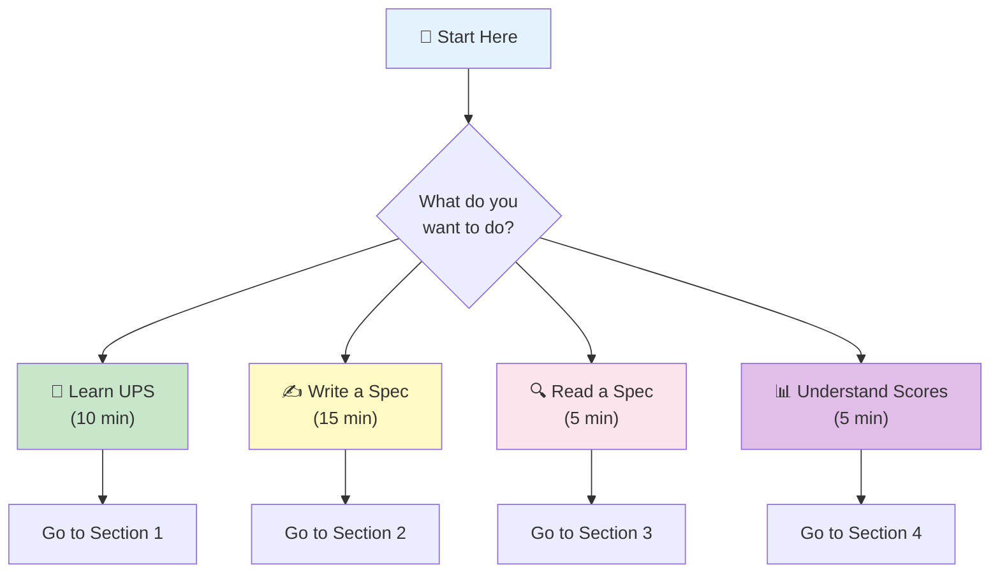

---

## 📖 Section 1: Learn UPS in 10 Minutes

### What is UPS?

**UPS = Universal Parser Specification**

It's a standard way to describe what a parser does, like a "nutrition label" for software.

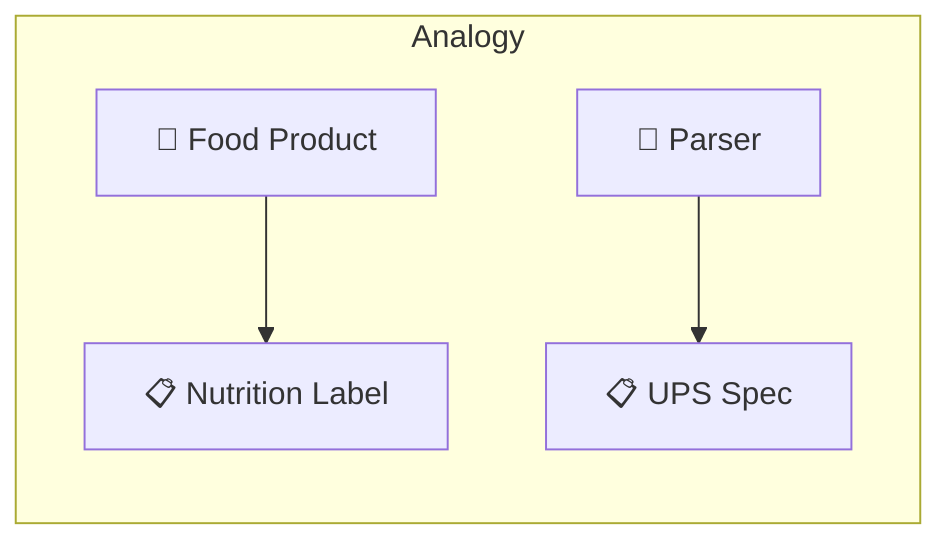

### The Structure (4 Main Parts)

```yaml
ups_version: "1.0"        # 1️⃣ Version

metadata:                  # 2️⃣ Identity
  name: "my-parser"
  version: "1.0.0"

parser:                    # 3️⃣ Definition
  input: {...}
  output: {...}

conformance:              # 4️⃣ Tests
  test_vectors: [...]
```

### Visual Summary

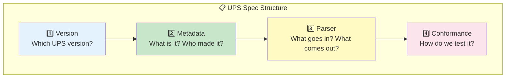

---

## ✍️ Section 2: Write Your First Spec (15 min)

### Step 1: Start with Template

```yaml
# 📄 my-parser.ups.yaml
ups_version: "1.0"

metadata:
  id: "urn:ups:example:my-parser:1.0.0"
  name: "my-parser"
  version: "1.0.0"
  description: "Brief description here"

parser:
  input:
    format:
      type: regex          # or abnf, peg, etc.
      grammar: "pattern"

  output:
    primary:
      type: ast
      schema:
        type: object

conformance:
  test_vectors:
    - id: test-1
      input: { inline: "test input" }
      expected: { success: true }
```

### Step 2: Fill in the Grammar

Choose your grammar type:

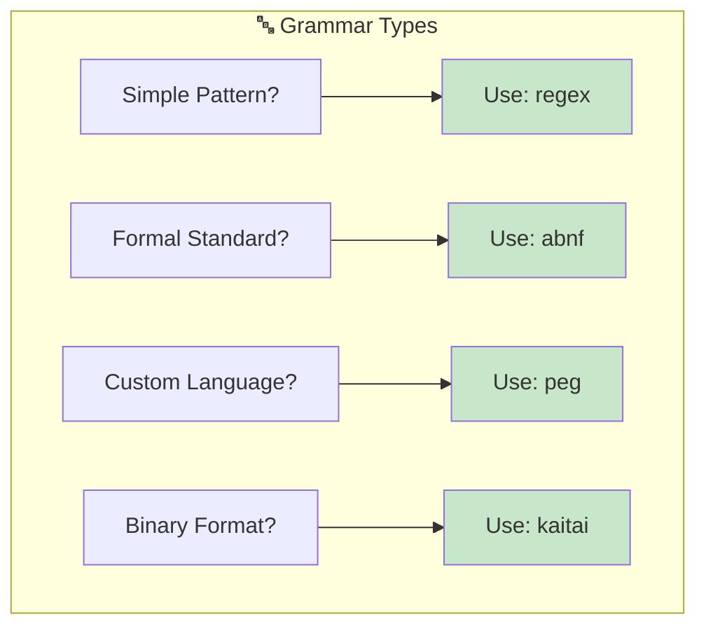

**Example - Email Parser:**

```yaml
parser:
  input:
    format:
      type: regex
      grammar: "^[a-zA-Z0-9._%+-]+@[a-zA-Z0-9.-]+\\.[a-zA-Z]{2,}$"
```

### Step 3: Define Output

```yaml
  output:
    primary:
      type: ast
      schema:
        type: object
        properties:
          local_part:
            type: string
            description: "Part before @"
          domain:
            type: string
            description: "Part after @"
```

### Step 4: Add Tests

```yaml
conformance:
  test_vectors:
    # ✅ Valid inputs
    - id: valid-simple
      category: valid
      input: { inline: "test@example.com" }
      expected:
        success:
          ast:
            local_part: "test"
            domain: "example.com"

    # ❌ Invalid inputs
    - id: invalid-no-at
      category: invalid
      input: { inline: "invalid.email" }
      expected:
        error: true
```

### Complete Example

```yaml
# 📧 email-parser.ups.yaml
ups_version: "1.0"

metadata:
  id: "urn:ups:example:email:1.0.0"
  name: "email-parser"
  version: "1.0.0"
  description: "Parses email addresses"
  tags: [email, validation]

parser:
  input:
    format:
      type: regex
      grammar: "^(?<local>[a-zA-Z0-9._%+-]+)@(?<domain>[a-zA-Z0-9.-]+\\.[a-zA-Z]{2,})$"

  output:
    primary:
      type: ast
      schema:
        type: object
        required: [local_part, domain]
        properties:
          local_part: { type: string }
          domain: { type: string }

    errors:
      codes:
        - code: EMAIL001
          message: "Invalid email format"

conformance:
  test_vectors:
    - id: valid-1
      input: { inline: "user@example.com" }
      expected:
        success:
          ast: { local_part: "user", domain: "example.com" }

    - id: valid-2
      input: { inline: "john.doe@company.org" }
      expected:
        success:
          ast: { local_part: "john.doe", domain: "company.org" }

    - id: invalid-1
      input: { inline: "not-an-email" }
      expected:
        error: { code: EMAIL001 }
```

### Validation Checklist

- [ ] `ups_version` is set to "1.0"
- [ ] `metadata.id` is unique
- [ ] `metadata.name` is kebab-case
- [ ] `metadata.version` follows semver
- [ ] `parser.input.format.type` is valid
- [ ] `parser.input.format.grammar` is defined
- [ ] At least one test vector exists

---

## 🔍 Section 3: Read a Spec (5 min)

### Quick Reference Card

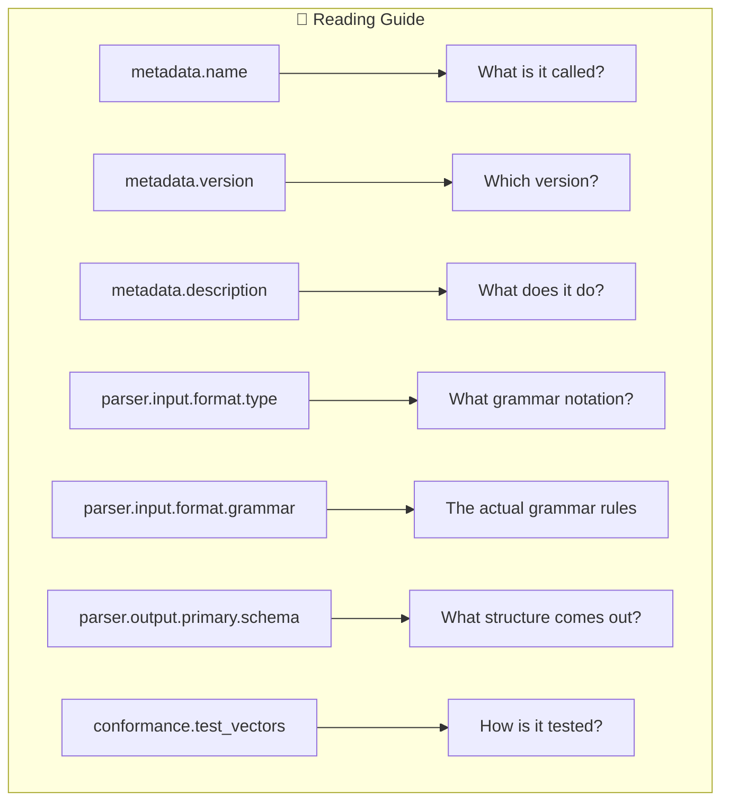

### Example: Reading JSON Spec

```yaml
# Look for these key parts:

metadata:
  name: "json-parser"           # 👈 It's a JSON parser
  version: "1.0.0"              # 👈 Version 1.0.0
  description: "RFC 8259..."    # 👈 Follows RFC 8259

parser:
  input:
    format:
      type: abnf                # 👈 Uses ABNF grammar
      grammar: |                # 👈 The grammar rules
        JSON-text = ws value ws
        ...

  output:
    primary:
      type: ast                 # 👈 Outputs an AST
      schema:                   # 👈 Schema defines structure
        type: object
        ...

conformance:
  test_vectors:                 # 👈 Test cases
    - id: empty-object
      input: "{}"
      expected: { success: true }
```

### What to Look For

| Section | Key Question |
|---------|--------------|
| `metadata` | What is this parser? |
| `parser.input` | What can it read? |
| `parser.output` | What does it produce? |
| `parser.modes` | Any special modes? |
| `conformance` | How is it tested? |
| `quality` | What standards must it meet? |

---

## 📊 Section 4: Understand Quality Scores (5 min)

### The Five Dimensions

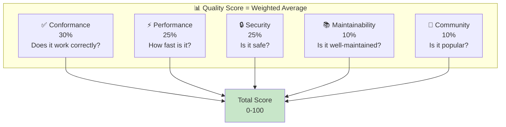

### How to Read a Score

```
Parser: System.Text.Json
Overall Score: 94.5 / 100

Breakdown:
├── Conformance:     100% (30 pts) ████████████████████
├── Performance:      92% (23 pts) ██████████████████░░
├── Security:         95% (24 pts) ███████████████████░
├── Maintainability:  85% ( 9 pts) █████████████████░░░
└── Community:        90% ( 9 pts) ██████████████████░░

Rank: #1 of 15 JSON parsers (C#)
```

### Score Interpretation

| Score Range | Meaning | Recommendation |
|-------------|---------|----------------|
| 90-100 | Excellent | ✅ Safe to use |
| 80-89 | Good | ✅ Recommended |
| 70-79 | Acceptable | ⚠️ Review carefully |
| 60-69 | Fair | ⚠️ Has issues |
| Below 60 | Poor | ❌ Avoid if possible |

### Conformance Levels

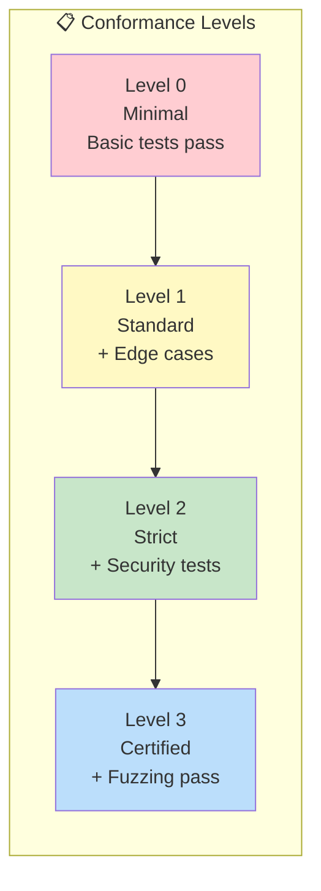

---

## 🛠️ Common Tasks

### Task: Find Best Parser for X

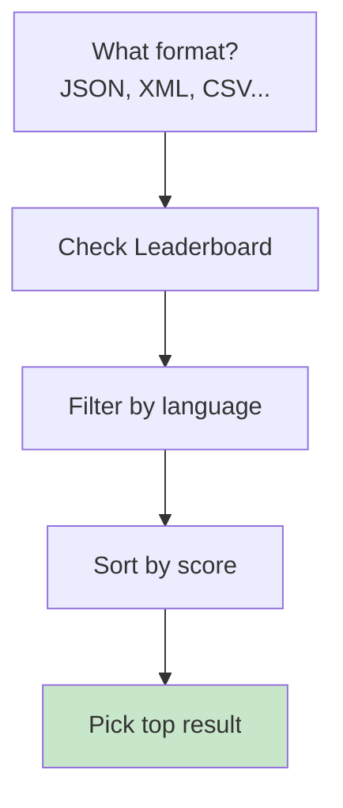

### Task: Verify Parser Quality

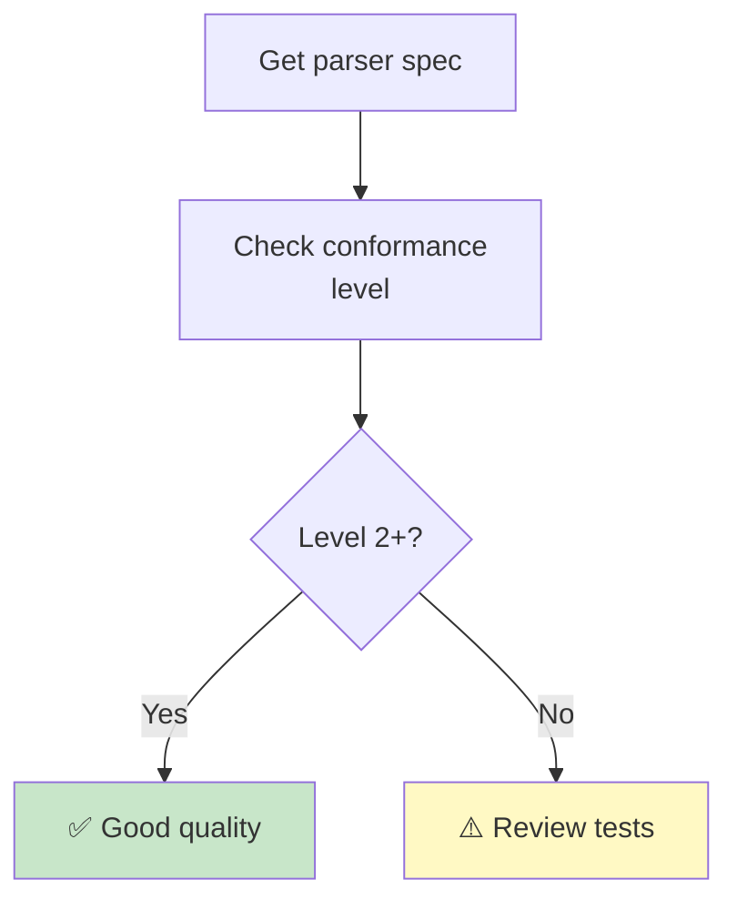

### Task: Compare Two Parsers

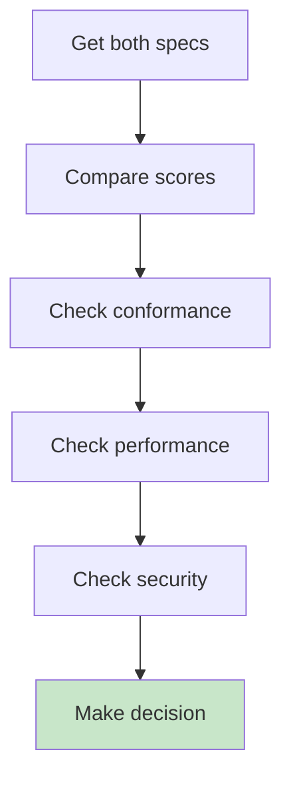

---

## 📁 File Organization

### Recommended Structure

```
my-project/
├── specs/
│   ├── my-parser.ups.yaml      # Your spec
│   └── tests/
│       ├── valid/              # Valid test inputs
│       └── invalid/            # Invalid test inputs
├── src/
│   └── parser/                 # Your implementation
└── docs/
    └── README.md               # Documentation
```

### Naming Convention

```
{format}-parser.ups.yaml

Examples:
- json-parser.ups.yaml
- csv-parser.ups.yaml
- http-request.ups.yaml
- my-custom-format.ups.yaml
```

---

## 🎓 Next Steps

### Learning Path

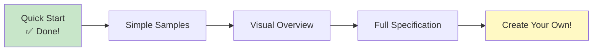

### Resources

| Level | Resource | Description |
|-------|----------|-------------|
| Beginner | [Simple Samples](SIMPLE-SAMPLES.md) | Step-by-step examples |
| Beginner | [Visual Overview](VISUAL-OVERVIEW.md) | Diagrams and concepts |
| Intermediate | [Class Diagrams](CLASS-DIAGRAMS.md) | Technical structure |
| Advanced | [Full Spec](../specification/UPS-SPECIFICATION-v1.0.md) | Complete reference |
| Reference | [Parser Catalog](../catalog/PARSER-CATALOG.md) | 1000+ parser ideas |

---

## ❓ FAQ

### Q: What grammar type should I use?

| Your Situation | Recommended |
|----------------|-------------|
| Simple pattern | `regex` |
| Following an RFC | `abnf` |
| Custom language | `peg` |
| Binary format | `kaitai` |
| Existing ANTLR grammar | `antlr4` |

### Q: How many tests do I need?

| Conformance Level | Minimum Tests |
|-------------------|---------------|
| Level 0 | 10+ (valid/invalid) |
| Level 1 | 50+ (including edge cases) |
| Level 2 | 100+ (including security) |
| Level 3 | 500+ (with fuzzing) |

### Q: What's the minimum spec?

```yaml
ups_version: "1.0"

metadata:
  id: "urn:ups:example:minimal:1.0.0"
  name: "minimal-parser"
  version: "1.0.0"

parser:
  input:
    format:
      type: regex
      grammar: "^hello$"
  output:
    primary:
      type: object
```

---

## 🆘 Need Help?

- 📖 Check the [documentation](../specification/UPS-SPECIFICATION-v1.0.md)
- 💬 Ask in community channels
- 🐛 Report issues on GitHub

---

*You're now ready to work with UPS specifications!*
