# UPS Simple Samples - Step by Step Guide

## Learn UPS Through Simple, Real Examples

This guide teaches you UPS through progressively complex examples, starting from the absolute basics.

---

## 📚 Table of Contents

1. [Level 1: Hello World Parser](#level-1-hello-world-parser)
2. [Level 2: Number Parser](#level-2-number-parser)
3. [Level 3: Email Parser](#level-3-email-parser)
4. [Level 4: Key-Value Parser](#level-4-key-value-parser)
5. [Level 5: Simple JSON Parser](#level-5-simple-json-parser)

---

## Level 1: Hello World Parser

### What We're Building

A parser that only accepts the word "hello".

```mermaid
graph LR
    subgraph "🎯 Goal"
        A["hello"] -->|parse| B[✅ Success]
        C["world"] -->|parse| D[❌ Error]
        E["Hello"] -->|parse| F[❌ Error]
    end
```



### The Spec (Minimal)

```yaml
# 📄 hello-parser.ups.yaml
# The simplest possible UPS spec

ups_version: "1.0"                    # Required: UPS version

metadata:                              # Required: Basic info
  id: "urn:ups:example:hello:1.0.0"   # Unique identifier
  name: "hello-parser"                 # Short name
  version: "1.0.0"                     # Spec version

parser:                                # Required: Parser definition
  input:
    format:
      type: regex                      # Using simple regex
      grammar: "^hello$"               # Only matches "hello"

  output:
    primary:
      type: object
      schema:
        type: object
        properties:
          matched:
            type: boolean
```

### Line-by-Line Explanation


### Test It

```yaml
conformance:
  test_vectors:
    - id: test-valid
      name: "Valid input"
      input:
        inline: "hello"
      expected:
        success:
          matched: true

    - id: test-invalid
      name: "Invalid input"
      input:
        inline: "world"
      expected:
        error: true
```

---

## Level 2: Number Parser

### What We're Building

A parser that recognizes positive integers.

```mermaid
graph LR
    subgraph "🎯 Goal"
        A["42"] -->|parse| B["✅ value: 42"]
        C["0"] -->|parse| D["✅ value: 0"]
        E["123"] -->|parse| F["✅ value: 123"]
        G["-5"] -->|parse| H["❌ Error"]
        I["abc"] -->|parse| J["❌ Error"]
    end
```



### The Spec

```yaml
ups_version: "1.0"

metadata:
  id: "urn:ups:example:number:1.0.0"
  name: "positive-integer-parser"
  version: "1.0.0"
  description: "Parses positive integers (0 and above)"

  # NEW: Adding tags for searchability
  tags:
    - number
    - integer
    - math

parser:
  input:
    format:
      type: regex
      grammar: "^(0|[1-9][0-9]*)$"     # 0 or digits not starting with 0
      #         │ │ └─ followed by any digits
      #         │ └─── first digit 1-9 (no leading zeros)
      #         └───── OR just "0"

  output:
    primary:
      type: ast
      schema:
        type: object
        required: [value]
        properties:
          value:
            type: integer
            minimum: 0
          raw:
            type: string
            description: "Original string representation"

  # NEW: Adding parsing modes
  modes:
    - id: strict
      name: "Strict Mode"
      default: true
      options:
        allow_leading_zeros: false

    - id: lenient
      name: "Lenient Mode"
      options:
        allow_leading_zeros: true      # Would accept "007"

conformance:
  test_vectors:
    - id: zero
      input: { inline: "0" }
      expected: { success: { ast: { value: 0 } } }

    - id: simple
      input: { inline: "42" }
      expected: { success: { ast: { value: 42 } } }

    - id: large
      input: { inline: "999999" }
      expected: { success: { ast: { value: 999999 } } }

    - id: leading-zero-strict
      mode: strict
      input: { inline: "007" }
      expected: { error: true }

    - id: leading-zero-lenient
      mode: lenient
      input: { inline: "007" }
      expected: { success: { ast: { value: 7 } } }

    - id: negative-rejected
      input: { inline: "-5" }
      expected: { error: true }

    - id: text-rejected
      input: { inline: "abc" }
      expected: { error: true }
```

### Key Concepts Introduced


---

## Level 3: Email Parser

### What We're Building

A parser for email addresses with proper structure.

```mermaid
graph TB
    subgraph "📧 Email Structure"
        EMAIL["john.doe@example.com"]
        EMAIL --> LOCAL["Local Part<br/>john.doe"]
        EMAIL --> AT["@<br/>separator"]
        EMAIL --> DOMAIN["Domain<br/>example.com"]
    end

    style EMAIL fill:#e3f2fd
    style LOCAL fill:#c8e6c9
    style AT fill:#fff9c4
    style DOMAIN fill:#f8bbd9
```



### The Spec

```yaml
ups_version: "1.0"

metadata:
  id: "urn:ups:example:email:1.0.0"
  name: "email-parser"
  version: "1.0.0"
  description: "Parses email addresses into components"

  # NEW: References to standards
  references:
    - type: rfc
      identifier: "RFC 5321"
      title: "Simple Mail Transfer Protocol"
      normative: true

  tags:
    - email
    - validation
    - contact

parser:
  input:
    format:
      type: regex
      grammar: |
        ^(?<local>[a-zA-Z0-9._%+-]+)@(?<domain>[a-zA-Z0-9.-]+\.[a-zA-Z]{2,})$

    # NEW: Encoding specification
    encoding:
      default: utf-8
      supported: [utf-8, ascii]

    # NEW: Constraints
    constraints:
      max_size: 254                    # RFC limit for email

  output:
    primary:
      type: ast
      schema:
        type: object
        required: [local_part, domain, full_address]
        properties:
          local_part:
            type: string
            description: "Part before @"
            examples: ["john.doe", "info", "sales"]
          domain:
            type: string
            description: "Part after @"
            examples: ["example.com", "company.org"]
          full_address:
            type: string
            description: "Complete email address"

    # NEW: Error definitions
    errors:
      codes:
        - code: EMAIL001
          message: "Missing @ symbol"
          severity: error

        - code: EMAIL002
          message: "Invalid local part"
          severity: error

        - code: EMAIL003
          message: "Invalid domain"
          severity: error

        - code: EMAIL004
          message: "Email too long"
          severity: error

conformance:
  test_vectors:
    # Valid cases
    - id: simple
      category: valid
      input: { inline: "test@example.com" }
      expected:
        success:
          ast:
            local_part: "test"
            domain: "example.com"

    - id: with-dots
      category: valid
      input: { inline: "john.doe@company.org" }
      expected:
        success:
          ast:
            local_part: "john.doe"
            domain: "company.org"

    - id: with-plus
      category: valid
      input: { inline: "user+tag@gmail.com" }
      expected:
        success:
          ast:
            local_part: "user+tag"
            domain: "gmail.com"

    # Invalid cases
    - id: no-at
      category: invalid
      input: { inline: "invalidemail.com" }
      expected:
        error:
          code: EMAIL001

    - id: no-domain
      category: invalid
      input: { inline: "test@" }
      expected:
        error:
          code: EMAIL003

    - id: no-local
      category: invalid
      input: { inline: "@example.com" }
      expected:
        error:
          code: EMAIL002

    # Edge cases
    - id: subdomain
      category: edge-case
      input: { inline: "admin@mail.company.co.uk" }
      expected:
        success:
          ast:
            domain: "mail.company.co.uk"
```

### Error Handling Flow

```mermaid
flowchart TD
    INPUT[Input Email] --> CHECK1{Has @ symbol?}
    CHECK1 -->|No| E1[❌ EMAIL001<br/>Missing @]
    CHECK1 -->|Yes| SPLIT[Split at @]

    SPLIT --> CHECK2{Valid local part?}
    CHECK2 -->|No| E2[❌ EMAIL002<br/>Invalid local]
    CHECK2 -->|Yes| CHECK3{Valid domain?}

    CHECK3 -->|No| E3[❌ EMAIL003<br/>Invalid domain]
    CHECK3 -->|Yes| CHECK4{Length ≤ 254?}

    CHECK4 -->|No| E4[❌ EMAIL004<br/>Too long]
    CHECK4 -->|Yes| SUCCESS[✅ Valid Email]

    style SUCCESS fill:#c8e6c9
    style E1 fill:#ffcdd2
    style E2 fill:#ffcdd2
    style E3 fill:#ffcdd2
    style E4 fill:#ffcdd2
```



---

## Level 4: Key-Value Parser

### What We're Building

A parser for simple key=value pairs (like .env files).

```mermaid
graph TB
    subgraph "📝 Key-Value Format"
        EXAMPLE["DATABASE_URL=postgres://localhost<br/>PORT=3000<br/>DEBUG=true"]
        EXAMPLE --> KV1["DATABASE_URL → postgres://localhost"]
        EXAMPLE --> KV2["PORT → 3000"]
        EXAMPLE --> KV3["DEBUG → true"]
    end
```



### The Spec (Using ABNF Grammar)

```yaml
ups_version: "1.0"

metadata:
  id: "urn:ups:example:keyvalue:1.0.0"
  name: "keyvalue-parser"
  version: "1.0.0"
  description: "Parses key=value configuration files"

  category:
    primary: text
    secondary: [structured, streaming]

  tags: [config, env, dotenv, settings]

parser:
  input:
    format:
      # NEW: Using ABNF grammar (more formal)
      type: abnf
      grammar: |
        ; Key-Value File Grammar
        file        = *( line LF )
        line        = comment / assignment / empty
        comment     = "#" *VCHAR
        assignment  = key "=" value
        empty       = *WSP
        key         = 1*( ALPHA / DIGIT / "_" )
        value       = *VCHAR

        ; Standard definitions
        ALPHA       = %x41-5A / %x61-7A    ; A-Z / a-z
        DIGIT       = %x30-39              ; 0-9
        VCHAR       = %x21-7E              ; visible characters
        WSP         = %x20 / %x09          ; space / tab
        LF          = %x0A                 ; line feed

      entry_rule: file

    encoding:
      default: utf-8
      newline: lf

    # NEW: Streaming support
    streaming:
      supported: true
      mode: chunked
      chunk_boundaries: line

  output:
    primary:
      type: ast
      schema:
        type: object
        properties:
          entries:
            type: array
            items:
              type: object
              properties:
                type:
                  enum: [assignment, comment, empty]
                key:
                  type: string
                value:
                  type: string
                line_number:
                  type: integer

          # Convenience: as a dictionary
          as_object:
            type: object
            additionalProperties:
              type: string

    # NEW: Event-based output (for streaming)
    events:
      events:
        - name: entry
          data:
            type: object
            properties:
              key: { type: string }
              value: { type: string }
        - name: comment
          data:
            type: object
            properties:
              text: { type: string }
      ordering: document-order

  modes:
    - id: strict
      name: "Strict"
      default: true
      options:
        allow_spaces_around_equals: false
        allow_quotes: false

    - id: dotenv
      name: "dotenv Compatible"
      options:
        allow_spaces_around_equals: true
        allow_quotes: true             # VALUE="quoted string"
        allow_export: true             # export KEY=value

  # NEW: Feature flags
  features:
    validation:
      schema_validation: false
    transformation:
      normalization: true
    interop:
      - json
      - yaml

conformance:
  test_vectors:
    - id: simple-assignment
      input:
        inline: "KEY=value"
      expected:
        success:
          ast:
            entries:
              - type: assignment
                key: "KEY"
                value: "value"
            as_object:
              KEY: "value"

    - id: multiple-lines
      input:
        inline: |
          DB_HOST=localhost
          DB_PORT=5432
          DB_NAME=myapp
      expected:
        success:
          ast:
            as_object:
              DB_HOST: "localhost"
              DB_PORT: "5432"
              DB_NAME: "myapp"

    - id: with-comments
      input:
        inline: |
          # Database config
          DB_HOST=localhost
          # Port number
          DB_PORT=5432
      expected:
        success:
          properties:
            entry_count: 2

    - id: empty-value
      input:
        inline: "EMPTY="
      expected:
        success:
          ast:
            as_object:
              EMPTY: ""
```

### Grammar Visualization

```mermaid
graph TB
    subgraph "🔤 ABNF Grammar Structure"
        FILE[file] --> LINE[line]
        LINE --> COMMENT["comment<br/># text..."]
        LINE --> ASSIGN["assignment<br/>KEY=value"]
        LINE --> EMPTY["empty<br/>(blank line)"]

        ASSIGN --> KEY["key<br/>letters, digits, _"]
        ASSIGN --> EQ["="]
        ASSIGN --> VALUE["value<br/>any characters"]
    end

    style FILE fill:#e3f2fd
    style COMMENT fill:#c8e6c9
    style ASSIGN fill:#fff9c4
    style EMPTY fill:#f5f5f5
```



---

## Level 5: Simple JSON Parser

### What We're Building

A simplified JSON parser (subset of full JSON).

```mermaid
graph TB
    subgraph "🎯 JSON Subset We'll Parse"
        JSON[JSON Value]
        JSON --> NULL["null"]
        JSON --> BOOL["true / false"]
        JSON --> NUM["numbers<br/>42, 3.14"]
        JSON --> STR["strings<br/>\"hello\""]
        JSON --> ARR["arrays<br/>[1, 2, 3]"]
        JSON --> OBJ["objects<br/>{\"key\": value}"]
    end

    style JSON fill:#e3f2fd
    style NULL fill:#f5f5f5
    style BOOL fill:#c8e6c9
    style NUM fill:#fff9c4
    style STR fill:#fce4ec
    style ARR fill:#e1bee7
    style OBJ fill:#b3e5fc
```

### The Spec

```yaml
ups_version: "1.0"

metadata:
  id: "urn:ups:example:simple-json:1.0.0"
  name: "simple-json-parser"
  version: "1.0.0"
  display_name: "Simple JSON Parser"
  description: |
    A simplified JSON parser for learning purposes.
    Supports: null, booleans, numbers, strings, arrays, objects.

  status: stable

  category:
    primary: structured
    secondary: [text, context-free]
    data_flow: pull

  domain: data-interchange
  tags: [json, data, learning, example]

  references:
    - type: rfc
      identifier: "RFC 8259"
      title: "The JSON Data Interchange Format"
      url: "https://www.rfc-editor.org/rfc/rfc8259"
      normative: true

parser:
  input:
    format:
      type: abnf
      grammar: |
        ; Simplified JSON Grammar
        JSON-text       = ws value ws

        ; Whitespace
        ws              = *( %x20 / %x09 / %x0A / %x0D )

        ; Values
        value           = null / boolean / number / string / array / object

        ; Primitives
        null            = %x6E.75.6C.6C                    ; "null"
        boolean         = true / false
        true            = %x74.72.75.65                    ; "true"
        false           = %x66.61.6C.73.65                 ; "false"

        ; Numbers (simplified)
        number          = [ "-" ] int [ frac ]
        int             = "0" / ( %x31-39 *DIGIT )         ; 0 or 1-9 followed by digits
        frac            = "." 1*DIGIT
        DIGIT           = %x30-39                          ; 0-9

        ; Strings (simplified - no escapes)
        string          = %x22 *char %x22                  ; "..."
        char            = %x20-21 / %x23-5B / %x5D-7E      ; printable except " and \

        ; Arrays
        array           = "[" ws [ value *( ws "," ws value ) ] ws "]"

        ; Objects
        object          = "{" ws [ member *( ws "," ws member ) ] ws "}"
        member          = string ws ":" ws value

      entry_rule: JSON-text

    encoding:
      default: utf-8

    constraints:
      max_size: 1048576        # 1 MB
      max_depth: 100           # Nesting limit
      max_string_length: 65536

  output:
    primary:
      type: ast
      schema:
        $schema: "https://json-schema.org/draft/2020-12/schema"
        $id: "simple-json-ast"

        $ref: "#/$defs/JsonValue"

        $defs:
          JsonValue:
            oneOf:
              - $ref: "#/$defs/JsonNull"
              - $ref: "#/$defs/JsonBoolean"
              - $ref: "#/$defs/JsonNumber"
              - $ref: "#/$defs/JsonString"
              - $ref: "#/$defs/JsonArray"
              - $ref: "#/$defs/JsonObject"

          JsonNull:
            type: object
            properties:
              type: { const: "null" }
            required: [type]

          JsonBoolean:
            type: object
            properties:
              type: { const: "boolean" }
              value: { type: boolean }
            required: [type, value]

          JsonNumber:
            type: object
            properties:
              type: { const: "number" }
              value: { type: number }
            required: [type, value]

          JsonString:
            type: object
            properties:
              type: { const: "string" }
              value: { type: string }
            required: [type, value]

          JsonArray:
            type: object
            properties:
              type: { const: "array" }
              elements:
                type: array
                items: { $ref: "#/$defs/JsonValue" }
            required: [type, elements]

          JsonObject:
            type: object
            properties:
              type: { const: "object" }
              members:
                type: array
                items:
                  type: object
                  properties:
                    key: { type: string }
                    value: { $ref: "#/$defs/JsonValue" }
            required: [type, members]

      preserves: [positions]

    errors:
      codes:
        - code: JSON001
          message: "Unexpected character"
          severity: error
        - code: JSON002
          message: "Unterminated string"
          severity: error
        - code: JSON003
          message: "Invalid number"
          severity: error
        - code: JSON004
          message: "Expected ':' after object key"
          severity: error
        - code: JSON005
          message: "Maximum depth exceeded"
          severity: error

conformance:
  version: "1.0.0"

  test_vectors:
    # Null
    - id: null-value
      category: valid
      input: { inline: "null" }
      expected:
        success:
          ast: { type: "null" }

    # Booleans
    - id: true-value
      category: valid
      input: { inline: "true" }
      expected:
        success:
          ast: { type: boolean, value: true }

    - id: false-value
      category: valid
      input: { inline: "false" }
      expected:
        success:
          ast: { type: boolean, value: false }

    # Numbers
    - id: zero
      category: valid
      input: { inline: "0" }
      expected:
        success:
          ast: { type: number, value: 0 }

    - id: integer
      category: valid
      input: { inline: "42" }
      expected:
        success:
          ast: { type: number, value: 42 }

    - id: negative
      category: valid
      input: { inline: "-17" }
      expected:
        success:
          ast: { type: number, value: -17 }

    - id: decimal
      category: valid
      input: { inline: "3.14" }
      expected:
        success:
          ast: { type: number, value: 3.14 }

    # Strings
    - id: empty-string
      category: valid
      input: { inline: '""' }
      expected:
        success:
          ast: { type: string, value: "" }

    - id: simple-string
      category: valid
      input: { inline: '"hello"' }
      expected:
        success:
          ast: { type: string, value: "hello" }

    # Arrays
    - id: empty-array
      category: valid
      input: { inline: "[]" }
      expected:
        success:
          ast: { type: array, elements: [] }

    - id: number-array
      category: valid
      input: { inline: "[1, 2, 3]" }
      expected:
        success:
          ast:
            type: array
            elements:
              - { type: number, value: 1 }
              - { type: number, value: 2 }
              - { type: number, value: 3 }

    # Objects
    - id: empty-object
      category: valid
      input: { inline: "{}" }
      expected:
        success:
          ast: { type: object, members: [] }

    - id: simple-object
      category: valid
      input: { inline: '{"name": "John"}' }
      expected:
        success:
          ast:
            type: object
            members:
              - key: "name"
                value: { type: string, value: "John" }

    # Nested
    - id: nested-structure
      category: valid
      input:
        inline: '{"user": {"name": "John", "age": 30}, "active": true}'
      expected:
        success:
          properties:
            is_valid: true

    # Invalid
    - id: invalid-bare-word
      category: invalid
      input: { inline: "undefined" }
      expected:
        error:
          code: JSON001

    - id: invalid-trailing-comma
      category: invalid
      input: { inline: "[1, 2,]" }
      expected:
        error: true

quality:
  conformance:
    minimum_level: level_1

  performance:
    throughput:
      minimum_mbps: 50
      target_mbps: 200

  security:
    required_protections:
      - stack-overflow-protection
```

### Parse Tree Example

```mermaid
graph TB
    subgraph "🌳 Parse Tree for: {\"name\": \"John\", \"age\": 30}"
        ROOT[Object]
        ROOT --> M1[Member 1]
        ROOT --> M2[Member 2]

        M1 --> K1["key: 'name'"]
        M1 --> V1[String: 'John']

        M2 --> K2["key: 'age'"]
        M2 --> V2[Number: 30]
    end

    style ROOT fill:#b3e5fc
    style M1 fill:#c8e6c9
    style M2 fill:#c8e6c9
    style K1 fill:#fff9c4
    style K2 fill:#fff9c4
    style V1 fill:#fce4ec
    style V2 fill:#fce4ec
```

---

## 🎓 What You've Learned


---

## 📖 Next Steps

| Completed Level | Next Challenge |
|-----------------|----------------|
| Level 1-3 | Try creating your own simple parser spec |
| Level 4 | Study ABNF grammar notation |
| Level 5 | Look at the full [JSON Parser spec](../../specs/examples/json-parser.ups.yaml) |
| All levels | Explore the [Parser Catalog](../catalog/PARSER-CATALOG.md) for ideas |

---

*These samples are part of the Universal Parser Specification learning materials.*
