# UPS Runtime Visual Guide

## Making Parser Quality Simple to Understand

---

## 1. The Problem We Solve

### Before UPS: Chaos

```mermaid
graph TB
    subgraph "Developer's Nightmare"
        DEV[👨‍💻 Developer]
        Q1{Which CSV<br/>library?}

        DEV --> Q1
        Q1 --> L1[pandas?]
        Q1 --> L2[CsvHelper?]
        Q1 --> L3[papaparse?]
        Q1 --> L4[100+ others?]

        L1 --> UNKNOWN[❓ No standard<br/>way to compare]
        L2 --> UNKNOWN
        L3 --> UNKNOWN
        L4 --> UNKNOWN
    end

    style UNKNOWN fill:#ffcccc,stroke:#ff0000
    style DEV fill:#e1f5fe
```

**Problem:** Developers waste hours researching which library to use. No standard comparison exists.

---

### After UPS: Clarity

```mermaid
graph TB
    subgraph "UPS Solution"
        DEV[👨‍💻 Developer]
        UPS[📋 UPS Runtime]

        DEV -->|"Which is best?"| UPS
        UPS -->|"Test all libraries"| TEST[🧪 Auto Test]
        TEST --> RANK[🏆 Rankings]

        RANK --> R1["#1 Sylvan ⭐⭐⭐⭐⭐"]
        RANK --> R2["#2 CsvHelper ⭐⭐⭐⭐"]
        RANK --> R3["#3 pandas ⭐⭐⭐"]
    end

    style UPS fill:#c8e6c9,stroke:#4caf50
    style RANK fill:#fff9c4,stroke:#fbc02d
```

**Solution:** One command shows which library is best for your needs.

---

## 2. How It Works (Simple View)

```mermaid
graph LR
    subgraph "📝 Input"
        SPEC[UPS Spec File<br/>━━━━━━━━━━━━<br/>• What to test<br/>• How to score<br/>• Expected results]
    end

    subgraph "⚙️ Process"
        ENGINE[UPS Runtime<br/>━━━━━━━━━━━━<br/>• Reads spec<br/>• Runs tests<br/>• Measures speed]
    end

    subgraph "📊 Output"
        REPORT[Results<br/>━━━━━━━━━━━━<br/>• Pass/Fail<br/>• Rankings<br/>• Recommendations]
    end

    SPEC --> ENGINE --> REPORT

    style SPEC fill:#e3f2fd,stroke:#1976d2
    style ENGINE fill:#f3e5f5,stroke:#7b1fa2
    style REPORT fill:#e8f5e9,stroke:#388e3c
```

---

## 3. The Three Layers

```mermaid
graph TB
    subgraph LAYER1 ["🎯 Layer 1: Specification"]
        SPEC["UPS Spec<br/>(What parsers SHOULD do)"]
        TESTS["Test Cases"]
        CRITERIA["Quality Criteria"]

        SPEC --- TESTS
        SPEC --- CRITERIA
    end

    subgraph LAYER2 ["🔧 Layer 2: Runtime Engine"]
        LOADER["Spec Loader"]
        RUNNER["Test Runner"]
        BENCH["Benchmark"]
        COMPARE["Comparator"]

        LOADER --> RUNNER
        LOADER --> BENCH
        RUNNER --> COMPARE
        BENCH --> COMPARE
    end

    subgraph LAYER3 ["🔌 Layer 3: Real Libraries"]
        PY["Python<br/>pandas, polars"]
        NET[".NET<br/>CsvHelper, Sylvan"]
        NODE["Node.js<br/>papaparse"]
    end

    LAYER1 --> LAYER2
    LAYER2 --> LAYER3

    style LAYER1 fill:#e3f2fd
    style LAYER2 fill:#fff3e0
    style LAYER3 fill:#f3e5f5
```

**Layer 1:** Rules and tests (what we expect)
**Layer 2:** Engine that runs everything
**Layer 3:** Actual libraries being tested

---

## 4. What is a UPS Spec?

```mermaid
graph TB
    subgraph SPEC ["📄 csv-parser.ups.yaml"]
        META["📌 METADATA<br/>─────────────<br/>Name: CSV Parser<br/>Version: 1.0<br/>Standard: RFC 4180"]

        INPUT["📥 INPUT<br/>─────────────<br/>Format: Text<br/>Encoding: UTF-8<br/>Delimiter: comma"]

        OUTPUT["📤 OUTPUT<br/>─────────────<br/>Headers: array<br/>Rows: array<br/>Count: number"]

        TESTS2["🧪 TESTS<br/>─────────────<br/>✓ Simple CSV<br/>✓ Quoted fields<br/>✓ Empty fields<br/>✗ Invalid input"]

        QUALITY["⭐ QUALITY<br/>─────────────<br/>Speed: 100 MB/s<br/>Memory: 3x input<br/>Security: No crashes"]
    end

    META --> INPUT
    INPUT --> OUTPUT
    OUTPUT --> TESTS2
    TESTS2 --> QUALITY

    style META fill:#e8eaf6
    style INPUT fill:#e3f2fd
    style OUTPUT fill:#e8f5e9
    style TESTS2 fill:#fff8e1
    style QUALITY fill:#fce4ec
```

**A UPS Spec is a recipe that describes:**
- What the parser should accept (input)
- What it should produce (output)
- How to test it (test cases)
- How to score it (quality metrics)

---

## 5. Language Adapters Explained

```mermaid
graph TB
    subgraph "Universal Translator"
        UPS_CMD["UPS Command<br/>'Parse this CSV'"]

        subgraph ADAPTERS ["🔌 Adapters = Translators"]
            PY_ADAPT["Python Adapter<br/>Speaks: Python"]
            NET_ADAPT[".NET Adapter<br/>Speaks: C#"]
            NODE_ADAPT["Node Adapter<br/>Speaks: JavaScript"]
        end

        subgraph LIBS ["📚 Libraries"]
            PANDAS["pandas<br/>(Python)"]
            CSVHELPER["CsvHelper<br/>(.NET)"]
            PAPA["papaparse<br/>(Node.js)"]
        end

        UPS_CMD --> PY_ADAPT
        UPS_CMD --> NET_ADAPT
        UPS_CMD --> NODE_ADAPT

        PY_ADAPT --> PANDAS
        NET_ADAPT --> CSVHELPER
        NODE_ADAPT --> PAPA
    end

    style UPS_CMD fill:#ffeb3b
    style PY_ADAPT fill:#4caf50,color:#fff
    style NET_ADAPT fill:#2196f3,color:#fff
    style NODE_ADAPT fill:#ff9800,color:#fff
```

**Adapters are translators** that let UPS Runtime talk to any library in any language.

---

## 6. Test Flow

```mermaid
sequenceDiagram
    participant User as 👨‍💻 User
    participant CLI as 🖥️ CLI
    participant Engine as ⚙️ Engine
    participant Adapter as 🔌 Adapter
    participant Library as 📚 Library

    User->>CLI: ups test csv-parser.ups.yaml
    CLI->>Engine: Load spec & run tests

    loop For each test
        Engine->>Adapter: Parse this data
        Adapter->>Library: Call library function
        Library-->>Adapter: Return result
        Adapter-->>Engine: Normalized result
        Engine->>Engine: Compare with expected
    end

    Engine-->>CLI: Test results
    CLI-->>User: ✅ 5 passed, ❌ 1 failed
```

---

## 7. Benchmark Flow

```mermaid
graph LR
    subgraph "⏱️ Benchmark Process"
        INPUT["📄 Test Data<br/>10 MB CSV"]

        WARM["🔥 Warmup<br/>100 runs<br/>(ignored)"]

        MEASURE["📏 Measure<br/>1000 runs<br/>(recorded)"]

        STATS["📊 Statistics<br/>• Average time<br/>• Memory used<br/>• Speed (MB/s)"]

        INPUT --> WARM --> MEASURE --> STATS
    end

    style INPUT fill:#e3f2fd
    style WARM fill:#fff3e0
    style MEASURE fill:#e8f5e9
    style STATS fill:#f3e5f5
```

**Benchmarking measures:**
- How FAST (MB per second)
- How much MEMORY
- How CONSISTENT (deviation)

---

## 8. Comparison Process

```mermaid
graph TB
    subgraph "🏆 Library Comparison"
        TEST_ALL["Test All Libraries<br/>with Same Data"]

        subgraph RESULTS ["Results"]
            R1["pandas<br/>Speed: 380 MB/s<br/>Memory: 256 MB<br/>Tests: 95%"]
            R2["CsvHelper<br/>Speed: 450 MB/s<br/>Memory: 128 MB<br/>Tests: 98%"]
            R3["Sylvan<br/>Speed: 890 MB/s<br/>Memory: 45 MB<br/>Tests: 97%"]
        end

        SCORE["Calculate Scores<br/>Based on Criteria"]

        RANK["🥇 Sylvan: 94.2<br/>🥈 CsvHelper: 87.5<br/>🥉 pandas: 71.8"]

        TEST_ALL --> R1
        TEST_ALL --> R2
        TEST_ALL --> R3

        R1 --> SCORE
        R2 --> SCORE
        R3 --> SCORE

        SCORE --> RANK
    end

    style RANK fill:#fff9c4,stroke:#f9a825
```

---

## 9. Scoring System

```mermaid
graph LR
    subgraph "⭐ How We Score"
        CORRECT["✓ Correctness<br/>Pass all tests?<br/>Handle edge cases?"]
        SPEED["⚡ Speed<br/>MB per second?<br/>Low latency?"]
        SECURE["🔒 Security<br/>No crashes?<br/>No vulnerabilities?"]
        MEMORY["💾 Memory<br/>Low usage?<br/>No leaks?"]

        CORRECT --> FINAL["Final<br/>Score"]
        SPEED --> FINAL
        SECURE --> FINAL
        MEMORY --> FINAL
    end

    style FINAL fill:#4caf50,color:#fff
```

---

## 10. CLI Commands Overview

```mermaid
graph TB
    subgraph "🖥️ UPS CLI Commands"
        CLI["ups"]

        TEST["ups test<br/>─────────────<br/>Run tests against<br/>a library"]

        BENCH["ups benchmark<br/>─────────────<br/>Measure<br/>performance"]

        COMPARE["ups compare<br/>─────────────<br/>Compare multiple<br/>libraries"]

        LIST["ups list<br/>─────────────<br/>Show available<br/>libraries"]

        CLI --> TEST
        CLI --> BENCH
        CLI --> COMPARE
        CLI --> LIST
    end

    style CLI fill:#1976d2,color:#fff
    style TEST fill:#e3f2fd
    style BENCH fill:#fff3e0
    style COMPARE fill:#e8f5e9
    style LIST fill:#fce4ec
```

---

## 11. Real World Example

```mermaid
graph TB
    subgraph "📋 Scenario: Choose Best CSV Library"
        NEED["Need: Parse 1GB CSV<br/>daily in production"]

        CMD["Run: ups compare csv-parser.ups.yaml --all"]

        subgraph TESTED ["Libraries Tested"]
            T1["Python: pandas, polars, csv"]
            T2[".NET: CsvHelper, Sylvan"]
            T3["Node: papaparse, csv-parse"]
        end

        RESULT["📊 Result"]

        REC["✅ Recommendation:<br/>Use Sylvan (.NET)<br/>• Fastest: 890 MB/s<br/>• Lowest memory: 45 MB<br/>• 97% test compliance"]

        NEED --> CMD
        CMD --> T1
        CMD --> T2
        CMD --> T3
        T1 --> RESULT
        T2 --> RESULT
        T3 --> RESULT
        RESULT --> REC
    end

    style NEED fill:#ffcdd2
    style REC fill:#c8e6c9,stroke:#4caf50
```

---

## 12. System Architecture (Bird's Eye View)

```mermaid
graph TB
    subgraph USER ["👤 User"]
        DEVELOPER["Developer"]
        CI["CI/CD System"]
    end

    subgraph INTERFACE ["🖥️ Interface"]
        CLI2["Command Line"]
        API["Future: Web API"]
    end

    subgraph CORE ["⚙️ UPS Runtime Core"]
        LOADER2["Spec Loader"]
        VALIDATOR["Validator"]
        EXECUTOR["Test Executor"]
        BENCHMARKER["Benchmarker"]
        REPORTER["Reporter"]
    end

    subgraph ADAPTERS2 ["🔌 Adapters"]
        A1["Python"]
        A2[".NET"]
        A3["Node.js"]
        A4["Rust"]
        A5["Go"]
    end

    subgraph PACKAGES ["📦 Package Managers"]
        P1["PyPI"]
        P2["NuGet"]
        P3["npm"]
        P4["crates.io"]
    end

    DEVELOPER --> CLI2
    CI --> CLI2
    CLI2 --> CORE
    API -.-> CORE

    CORE --> A1
    CORE --> A2
    CORE --> A3
    CORE --> A4
    CORE --> A5

    A1 --> P1
    A2 --> P2
    A3 --> P3
    A4 --> P4

    style CORE fill:#e8f5e9
    style ADAPTERS2 fill:#e3f2fd
    style PACKAGES fill:#fff3e0
```

---

## 13. Data Flow (Simplified)

---

## 14. Implementation Phases

```mermaid
graph LR
    subgraph "🚀 Development Journey"
        P0["Phase 0<br/>─────────<br/>• 1 format<br/>• 1 language<br/>• Basic tests"]

        P1["Phase 1<br/>─────────<br/>• CSV format<br/>• Python<br/>• 2 libraries"]

        P2["Phase 2<br/>─────────<br/>• + JSON<br/>• + .NET<br/>• + Node.js"]

        P3["Phase 3<br/>─────────<br/>• Benchmarks<br/>• Comparison<br/>• Rankings"]

        P4["Phase 4<br/>─────────<br/>• Production<br/>• CI/CD<br/>• Reports"]

        P0 --> P1 --> P2 --> P3 --> P4
    end

    style P0 fill:#ffcdd2
    style P1 fill:#fff9c4
    style P2 fill:#c8e6c9
    style P3 fill:#bbdefb
    style P4 fill:#e1bee7
```

---

## 15. Who Benefits?

```mermaid
graph TB
    subgraph "🎯 Benefits by Role"
        subgraph DEV2 ["👨‍💻 Developers"]
            D1["Find best library fast"]
            D2["Trust quality scores"]
            D3["Save research time"]
        end

        subgraph TEAM ["👥 Teams"]
            T1["Standard evaluation"]
            T2["Objective decisions"]
            T3["Less debate"]
        end

        subgraph LIB ["📚 Library Authors"]
            L1["Prove quality"]
            L2["Get certified"]
            L3["Attract users"]
        end

        subgraph ORG ["🏢 Organizations"]
            O1["Reduce risk"]
            O2["Compliance proof"]
            O3["Better software"]
        end
    end

    style DEV2 fill:#e3f2fd
    style TEAM fill:#e8f5e9
    style LIB fill:#fff3e0
    style ORG fill:#fce4ec
```

---

## 16. Quick Reference Card

```mermaid
graph TB
    subgraph "📋 UPS Runtime Quick Reference"
        subgraph WHAT ["What It Does"]
            W1["✓ Tests parser libraries"]
            W2["✓ Measures performance"]
            W3["✓ Compares options"]
            W4["✓ Recommends best"]
        end

        subgraph HOW ["How To Use"]
            H1["ups test spec.yaml"]
            H2["ups benchmark spec.yaml"]
            H3["ups compare spec.yaml --all"]
        end

        subgraph WHY ["Why Use It"]
            Y1["Save time"]
            Y2["Make better choices"]
            Y3["Prove quality"]
        end
    end

    style WHAT fill:#e8f5e9
    style HOW fill:#e3f2fd
    style WHY fill:#fff3e0
```

---

## Summary

```mermaid
graph TB
    subgraph "🎯 UPS Runtime in One Picture"
        PROBLEM["❌ Problem<br/>Too many libraries<br/>No way to compare"]

        SOLUTION["✅ Solution<br/>UPS Runtime tests<br/>all libraries fairly"]

        RESULT2["🏆 Result<br/>Best library for<br/>your needs"]

        PROBLEM --> SOLUTION --> RESULT2
    end

    style PROBLEM fill:#ffcdd2
    style SOLUTION fill:#fff9c4
    style RESULT2 fill:#c8e6c9
```

---

*UPS Runtime: One test, all libraries, best choice.*
