# Universal Parser Specification - Visual Overview

## Understanding UPS in Pictures

This document explains the Universal Parser Specification (UPS) using diagrams and simple language that anyone can understand.

---

## 🎯 What Problem Does UPS Solve?

### The Problem Today

Imagine you want to read a JSON file. There are hundreds of different JSON parsers:

```mermaid
graph TD
    subgraph "The Problem: Too Many Choices, No Standard"
        JSON[JSON File] --> Q{Which parser<br/>should I use?}
        Q --> P1[Parser A<br/>Fast but buggy]
        Q --> P2[Parser B<br/>Slow but safe]
        Q --> P3[Parser C<br/>Who knows?]
        Q --> P4[Parser D<br/>No documentation]
        Q --> P5[... 100+ more]

        P1 --> CONFUSED[😕 Confused Developer]
        P2 --> CONFUSED
        P3 --> CONFUSED
        P4 --> CONFUSED
        P5 --> CONFUSED
    end

    style CONFUSED fill:#ffcccc
    style Q fill:#ffffcc
```



### The Solution: UPS

With UPS, every parser has a standard "report card" that tells you exactly what it can do:

```mermaid
graph TD
    subgraph "The Solution: One Standard, Clear Choices"
        JSON2[JSON File] --> UPS[UPS Standard]
        UPS --> SCORE[Quality Scores]

        SCORE --> R1[Parser A<br/>⭐⭐⭐⭐⭐ 95/100]
        SCORE --> R2[Parser B<br/>⭐⭐⭐⭐ 82/100]
        SCORE --> R3[Parser C<br/>⭐⭐⭐ 71/100]

        R1 --> HAPPY[😊 Informed Decision]

        style HAPPY fill:#ccffcc
        style UPS fill:#cce5ff
        style SCORE fill:#e5ccff
    end
```



---

## 🏗️ High-Level Architecture

### The Big Picture


---

## 📄 What's Inside a UPS Spec?

### The 5 Main Parts

Think of a UPS spec like a **product label** for a parser:


### Real-World Analogy


---

## 🔄 How Does It Work?

### The Complete Flow

```mermaid
sequenceDiagram
    participant Author as 👤 Spec Author
    participant Spec as 📋 UPS Spec
    participant Registry as 📚 Registry
    participant Dev as 👨‍💻 Developer
    participant Impl as 🔧 Implementation
    participant Engine as ⚙️ Quality Engine
    participant Board as 🏆 Leaderboard

    Note over Author,Board: Phase 1: Create Specification
    Author->>Spec: Write parser spec in YAML
    Author->>Spec: Define grammar rules
    Author->>Spec: Add test cases
    Spec->>Registry: Publish spec

    Note over Author,Board: Phase 2: Implement Parser
    Dev->>Registry: Find spec for JSON parser
    Registry->>Dev: Return ups spec
    Dev->>Impl: Build parser following spec

    Note over Author,Board: Phase 3: Quality Testing
    Impl->>Engine: Submit for testing
    Engine->>Engine: Run conformance tests
    Engine->>Engine: Run benchmarks
    Engine->>Engine: Security scan
    Engine->>Board: Calculate quality score

    Note over Author,Board: Phase 4: Ranking
    Board->>Board: Update rankings
    Board->>Dev: Show position: #3 of 15
```



---

## 🎮 Parser Types Explained

### What Kinds of Parsers Can UPS Describe?

```mermaid
graph TB
    subgraph "🌐 All Parser Types"
        CENTER[UPS Can Describe<br/>ANY Parser]

        CENTER --> TEXT[📝 Text Parsers]
        CENTER --> BIN[💾 Binary Parsers]
        CENTER --> PROTO[🌐 Protocol Parsers]
        CENTER --> LANG[💻 Language Parsers]
        CENTER --> STREAM[🌊 Streaming Parsers]

        TEXT --> T1[JSON]
        TEXT --> T2[XML]
        TEXT --> T3[YAML]
        TEXT --> T4[CSV]

        BIN --> B1[Protobuf]
        BIN --> B2[MessagePack]
        BIN --> B3[Images PNG/JPEG]
        BIN --> B4[PDF]

        PROTO --> P1[HTTP]
        PROTO --> P2[DNS]
        PROTO --> P3[WebSocket]
        PROTO --> P4[MQTT]

        LANG --> L1[Python]
        LANG --> L2[JavaScript]
        LANG --> L3[SQL]
        LANG --> L4[GraphQL]

        STREAM --> S1[Log Files]
        STREAM --> S2[Event Streams]
        STREAM --> S3[Real-time Data]
    end

    style CENTER fill:#fff176
    style TEXT fill:#a5d6a7
    style BIN fill:#90caf9
    style PROTO fill:#ce93d8
    style LANG fill:#ffab91
    style STREAM fill:#80deea
```



---

## ⭐ Quality Scoring System

### How We Measure Parser Quality


### What Each Component Means

```mermaid
graph LR
    subgraph "📊 Quality Dimensions Explained"
        direction TB

        C[✅ Conformance<br/>30%] --> C1[Does it pass all tests?]
        C --> C2[Does it follow the spec?]

        P[⚡ Performance<br/>25%] --> P1[How fast is it?]
        P --> P2[How much memory?]

        S[🔒 Security<br/>25%] --> S1[Any vulnerabilities?]
        S --> S2[Can it be crashed?]

        M[📚 Maintainability<br/>10%] --> M1[Good documentation?]
        M --> M2[Test coverage?]

        CM[👥 Community<br/>10%] --> CM1[How many downloads?]
        CM --> CM2[User ratings?]
    end

    style C fill:#c8e6c9
    style P fill:#bbdefb
    style S fill:#ffcdd2
    style M fill:#fff9c4
    style CM fill:#e1bee7
```



### Scoring Example

```mermaid
graph TB
    subgraph "🏆 Example: JSON Parser Comparison"
        direction LR

        subgraph "Parser A"
            A[System.Text.Json] --> AS[Score: 94.5]
            AS --> AC[Conformance: 100%]
            AS --> AP[Performance: 92%]
            AS --> ASC[Security: 95%]
        end

        subgraph "Parser B"
            B[Newtonsoft.Json] --> BS[Score: 89.2]
            BS --> BC[Conformance: 98%]
            BS --> BP[Performance: 85%]
            BS --> BSC[Security: 90%]
        end

        subgraph "Parser C"
            CC[Custom Parser] --> CS[Score: 71.0]
            CS --> CCC[Conformance: 85%]
            CS --> CP[Performance: 70%]
            CS --> CSC[Security: 65%]
        end
    end

    AS --> WINNER[🥇 Winner!]

    style A fill:#c8e6c9
    style B fill:#fff9c4
    style CC fill:#ffcdd2
    style WINNER fill:#ffd700
```



---

## 🏟️ Challenge Arena

### How Parsers Compete


### Challenge Flow Simplified

```mermaid
graph LR
    subgraph "🏆 Challenge Process"
        A[🆕 New Parser<br/>Challenges<br/>Current Champion] --> B[✅ Test<br/>All tests<br/>must pass]
        B --> C[⚡ Benchmark<br/>Speed & Memory<br/>comparison]
        C --> D[🔒 Security<br/>Vulnerability<br/>scan]
        D --> E[🗳️ Vote<br/>Community<br/>decides]
        E --> F{Winner?}
        F -->|Yes| G[🏆 New<br/>Champion!]
        F -->|No| H[Current champ<br/>stays]
    end

    style A fill:#e3f2fd
    style B fill:#e8f5e9
    style C fill:#fff3e0
    style D fill:#fce4ec
    style E fill:#f3e5f5
    style G fill:#c8e6c9
```



---

## 👥 Who Uses UPS?

### User Roles

```mermaid
graph TB
    subgraph "🎭 UPS User Roles"
        direction TB

        subgraph "Spec Authors"
            SA[📝 Standards Bodies<br/>RFC authors, W3C, ISO]
            SA --> SA1[Write official specs]
            SA --> SA2[Define test suites]
        end

        subgraph "Implementers"
            IMP[👨‍💻 Parser Developers<br/>Library authors]
            IMP --> IMP1[Build parsers]
            IMP --> IMP2[Compete for rankings]
        end

        subgraph "Consumers"
            CON[🏢 App Developers<br/>End users]
            CON --> CON1[Find best parser]
            CON --> CON2[Trust quality scores]
        end

        subgraph "Community"
            COM[👥 Reviewers & Voters<br/>Testers]
            COM --> COM1[Report bugs]
            COM --> COM2[Vote on challenges]
        end
    end

    style SA fill:#bbdefb
    style IMP fill:#c8e6c9
    style CON fill:#fff9c4
    style COM fill:#f8bbd9
```



---

## 🔧 Simple Example Walkthrough

### Creating a Simple Parser Spec

Let's create a spec for parsing **email addresses**:

```mermaid
graph TB
    subgraph "📧 Email Parser Spec - Step by Step"
        direction TB

        STEP1[Step 1: Metadata] --> M1["name: email-parser<br/>version: 1.0.0"]

        STEP2[Step 2: Grammar] --> G1["pattern: name@domain.com<br/>name = letters/numbers<br/>domain = letters.letters"]

        STEP3[Step 3: Tests] --> T1["✓ test@example.com → valid<br/>✗ invalid@ → error<br/>✗ @noname.com → error"]

        STEP4[Step 4: Quality] --> Q1["Must handle 10,000/sec<br/>No crashes on bad input"]

        STEP1 --> STEP2 --> STEP3 --> STEP4
    end

    style STEP1 fill:#e3f2fd
    style STEP2 fill:#e8f5e9
    style STEP3 fill:#fff9c4
    style STEP4 fill:#fce4ec
```



### The Actual YAML (Simplified)

```yaml
# 📧 Simple Email Parser Spec
ups_version: "1.0"

metadata:
  name: "email-parser"
  version: "1.0.0"
  description: "Parses email addresses"

parser:
  input:
    format:
      type: regex
      grammar: "^[a-zA-Z0-9._%+-]+@[a-zA-Z0-9.-]+\\.[a-zA-Z]{2,}$"

  output:
    primary:
      type: object
      schema:
        properties:
          local_part: { type: string }   # "john.doe"
          domain: { type: string }       # "example.com"

conformance:
  test_vectors:
    - id: valid-simple
      input: "test@example.com"
      expected:
        success: true

    - id: invalid-no-at
      input: "invalid.email.com"
      expected:
        error: true
```

---

## 📊 Data Flow Diagram

### How Data Moves Through UPS

```mermaid
flowchart TB
    subgraph "📥 Input"
        RAW[Raw Text/Binary<br/>e.g., '{"name":"John"}']
    end

    subgraph "⚙️ Parser"
        LEXER[1. Lexer<br/>Break into tokens]
        PARSER[2. Parser<br/>Build structure]
        VALID[3. Validator<br/>Check rules]
    end

    subgraph "📤 Output"
        AST[Abstract Syntax Tree<br/>Structured data]
        ERR[Errors<br/>If invalid input]
    end

    RAW --> LEXER
    LEXER --> |"tokens"| PARSER
    PARSER --> |"tree"| VALID
    VALID --> |"valid"| AST
    VALID --> |"invalid"| ERR

    style RAW fill:#e3f2fd
    style LEXER fill:#fff9c4
    style PARSER fill:#fff9c4
    style VALID fill:#fff9c4
    style AST fill:#c8e6c9
    style ERR fill:#ffcdd2
```

### JSON Parsing Example

```mermaid
flowchart LR
    subgraph "Input"
        IN["{ \"name\": \"John\" }"]
    end

    subgraph "Tokens"
        T1["{"]
        T2["name"]
        T3[":"]
        T4["John"]
        T5["}"]
    end

    subgraph "AST Output"
        OUT["Object<br/>├── key: name<br/>└── value: John"]
    end

    IN --> T1 --> T2 --> T3 --> T4 --> T5 --> OUT

    style IN fill:#e3f2fd
    style OUT fill:#c8e6c9
```

---

## 🎯 Key Benefits Summary


---

## 🚀 Getting Started Path


---

## 📚 Next Steps

| If you want to... | Go to... |
|-------------------|----------|
| Understand the full spec | [UPS Specification](../specification/UPS-SPECIFICATION-v1.0.md) |
| See all 1000+ parser examples | [Parser Catalog](../catalog/PARSER-CATALOG.md) |
| Learn adoption strategy | [Adoption Guide](../guides/ADOPTION-GUIDE.md) |
| View example specs | [Examples](../../specs/examples/) |
| Understand design decisions | [Design Rationale](../design/DESIGN-RATIONALE.md) |

---

*This visual guide is part of the Universal Parser Specification documentation.*
